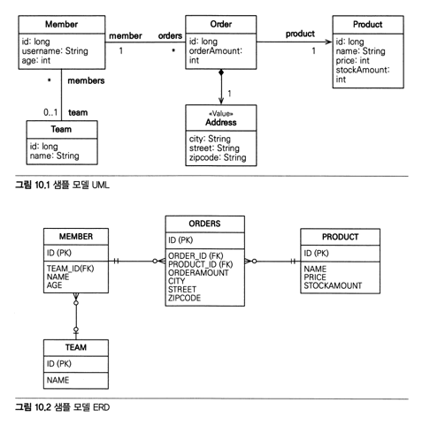

# 10.1 객체지향 쿼리 소개
`em.find()`와 객체 그래프 탐색으로 검색을 할 수 있지만 좀 더 복잡한 검색 방법이 필요하다. 이를 위해 JPQL이 만들어졌다.
- 테이블이 아닌 객체를 대상으로 검색
- SQL을 추상화해서 특정 데이터베이스 SQL에 의존 X

JPA가 제공하는 검색 방법
- JPQL
- Criteria 쿼리: JPQL 작성을 도와주는 API
- 네이티브 SQL: 직접 SQL 사용

JPA 공식지원 X 검색 방법
- QueryDSL: JPQL 작성을 도와주는 빌더 클래스
- JDBC 직접사용: MyBatis같은 SQL 매퍼

=> 결국 중요한 것은 JPQL이다.

## 10.1.1 JQPL 소개
Java Persistence Query Language
- SQL과 비슷
- SQL을 추상화해서 특정 데이터베이스에 의존 X
- SQL보다 간결

```kotlin
@Entity
class Member (
  @Column(name = "name")
  var username: String
)

val jpql = "select m from Member as m where m.username = 'kim'"
val resultList = em.createQuery(jpql, Member::class.java).resultList
```

```sql
// 변환된 query
select
  member.id,
  member.age as age,
  member.name as name
from
  Member member
where
  member.name ='kim'
```

## 10.1.2 Criteria 쿼리 소개
Criteria는 JPQL을 생성하는 빌더 클래스: `query.select(m).where(...)`
- 문자기반이 아니기 때문에 컴파일 시점에 오류를 발견할 수 있다.
- IDE를 통한 코드 자동완성 지원
- 동적 쿼리 작성 편함

```kotlin
// Criteria 사용 준비
val cb = em.criteriaBuilder
val query: CriteriaQuery<Member> = cb.createQuery(Member::class.java)

// 루트클래스(조회를 시작할 클래스)
val m: Root<Member> = query.from(Member::class.java)

// 쿼리 생성
val cq: CriteriaQuery<Member> = query.select(m).where(cb.equal(m.get<String>("username"), "kim"))
val resultList: List<Member> = em.createQuery(cq).resultList
```
- `m.get<String>("username")`을 사용한 부분은 아쉽다. 코드로 작성하려면 메타모델을 사용.

```
// 메타모델 사용 전 -> 사용 후
// (어떻게 설정해야하는지 모르겠다. hibernate-jpamodelgen도 추가했는데 생성안해준다. 모르겠다. 안해)
m.get("username") -> m.get(Member_.username)
```
- Criteria의 장점이 많지만 모든 장점을 상쇄할 정도로 복잡하고 장황하다.
- 사용도 불편하고 코드도 한눈에 들어오지 않는다.

## 10.1.3 QueryDSL 소개
- 코드기반이면서도 단순하고 사용하기 쉽다.
- 작성한 코드도 JPQL과 비슷해서 한눈에 들어온다.

```
JPAQuery query = new JPAQuery(em);
QMember member = QMember.member;
List<Member> members = query.from(member)
  .where(member.username.eq("kim"))
   .list(member);
```
- QMember는 member 엔티티 클래스를 기반으로 생성한 QueryDSL 쿼리 전용클래스

## 10.1.4 네이티브 SQL 소개
- 가끔은 특정 데이터베이스에 의존하는 기능을 사용해야할 때가 있다.

## 10.1.5 JDBC 직접 사용, 마이바티스 같은 SQL 매퍼 프레임워크 사용
- JPA는 JDBC 커넥션을 획득하는 API를 제공하지 않으므로 JPA 구현체가 제공하는 방법을 사용해야 한다.
```
Session session = em.unwrap(Session.class);
session.doWork(new Work() {
  @Override
  public void execute(Connection connection) throws SQLException {
    // work...
  }
});
```
- JPA EntityManager에서 하이버네이트 Session을 구하고 Session의 doWork() 메소드를 호출한다.
- JDBC나 마이바티스를 JPA와 함께 사용하면 영속성 컨텍스트를 적절한 시점(우회 접근을 하기 전)에 강제로 플러시해야한다.  
  JPA가 이 우회 접근에 대해 알지 못하기 때문이다.
- 스프링 프레임워크의 AOP를 활용해 우회접근하는 메소드 호출시마다 플러시를 하면 문제를 해결할 수 있다.

# 10.2 JPQL
- 어떤 방법이든 JPQL에서 모든 것이 시작
- JPQL은 엔티티 객체를 대상으로 쿼리
- 특정 데이터베이스에 의존 X
- 결국 SQL로 변환



## 10.2.1 기본 문법과 쿼리 API
- JPQL도 SELECT, UPDATE, DELETE를 사용할 수 있다.
- 엔티티 저장은 persist로 수행되므로 INSERT는 없다.

```
select :: =
  select_절
  from_절
  [where_절]
  [groupby_절]
  [having_절]
  [orderby_절]

update_문 :: update_절 [where_절]
delete_문 :: delete_절 [where_절]
```

### SELECT 문
```
select m from Member as m where m.username = 'Hello'
```
- 대소문자 구분: Member, username은 대소문자 구분. select 같은 JPQL 키워드는 대소문자 구분 X
- 엔티티 이름: Member는 클래스명이 아니라 엔티티명
- 별칭은 필수: Member as m 과 같이 별칭을 사용해야 한다. `Member m`과 같이 as 생략 가능

### TypeQuery, Query

```kotlin
private fun queryWithTypeQuery(em: EntityManager) {
  var query: TypedQuery<Member> = em.createQuery("select m from ch10Member m", Member::class.java)
  query.resultList.forEach { member ->
    log("member = ${member.name}")
  }
}

private fun queryWithQuery(em: EntityManager) {
  var query: Query = em.createQuery("select m.name, m.age from ch10Member m")
  query.resultList.forEach { obj ->
    val objects = obj as Array<*>
    log("member = ${objects[0]}")
  }
}
```
- 반환타입을 명확히 지정할 수 있으면 TypedQuery, 아니면 Query를 사용
- Query 객체는 조회대상이 하나면 Object, 둘 이상이면 Object[]를 반환

## 10.2.2 파라미터 바인딩
- JDBC는 위치기준 바인딩만 지원, JPQL은 이름기준 바인딩도 지원

```kotlin
private fun queryMember(em: EntityManager) {
  val query: TypedQuery<Member> = em.createQuery("select m from ch10Member m where m.name = :name", Member::class.java)
  query.setParameter("name", "kim") // 이름 기준 바인딩
  query.resultList.forEach { member ->
    log("member = ${member.name}")
  }
}

private fun queryMember2(em: EntityManager) {
  val query: TypedQuery<Member> = em.createQuery("select m from ch10Member m where m.name = :name", Member::class.java)
  query.setParameter(1, "kim") // 위치 기준 바인딩
  query.resultList.forEach { member ->
    log("member = ${member.name}")
  }
}
```
- 이름 기준 바인딩이 좀 더 명확하다.
- JPQL에 직접 문자를 넣도록 할수도 있지만 SQL 인젝션 방어, 재사용을 위해서 바인딩을 사용하는 것이 좋다. 

## 10.2.3 프로젝션
SELECT 절에 조회대상을 지정하는 것을 프로젝션이라고 한다.

### 엔티티 프로젝션
```
select m from Member m // 회원 조회
select m.team from Member m // 팀 조회
```
- 이렇게 조회한 엔티티는 영속성 컨텍스트에서 관리된다.

### 임베디드 프로젝션
임베디드 타입은 엔티티와 거의 비슷하게 사용된다. 다만 조회의 시작점이 될 수 없다.
```
select a from Address a
```
위와 같이 임베디드 타입을 사용하면 안된다. 대신 아래와 같이 사용한다.
```kotlin
val query = "select o.address from Order o"
val addresses = em.createQuery(query, Address::class.java).resultList
```
임베디드 타입은 엔티티가 아니고 값 타입이므로 영속성 컨텍스트에서 관리되지 않는다.

### 스칼라 타입 프로젝션
숫자, 문자와 같은 기본 데이터 타입들을 스칼라 타입이라고 한다. 아래와 같이 사용할 수 있다.
```kotlin
val usernames = em.createQuery("select m.name from Member m", String::class.java).resultList
```
중복 제거를 위해 DISTINCT도 사용할 수 있고 아래와 같이 통계 쿼리를 사용할 수 있다.
```kotlin
val amountAvg = em.createQuery("select AVG(o.orderAmount) from Order o", Double::class.java).singleResult
```

### 여러값 조회
```kotlin
private fun queryWithQuery(em: EntityManager) {
  val query: Query = em.createQuery("select m.name, m.team m.period from Member m")
  query.resultList.forEach { obj ->
    val objects = obj as Array<*>
    val name = objects[0] as String // 스칼라
    val team = objects[1] as Team // 엔티티
    val age = objects[2] as Period // 임베디드
  }
}
```
- 꼭 필요한 데이터만 조회가 필요한 경우 Query를 사용해 여러값을 조회할 수 있다.
- 스칼라타입, 엔티티타입, 임베디드타입을 조회할 수 있고 엔티티 타입은 영속성 컨텍스트에서 관리된다.

### NEW 명령어
```kotlin
class MemberDTO(
  val name: String,
  val age: Int
)

private fun queryToDTO(em: EntityManager) {
  val query: TypedQuery<MemberDTO> = em.createQuery("select new net.joostory.jpastudy.ch10.MemberDTO(m.name, m.age) from ch10Member m where m.name = :name", MemberDTO::class.java)
  query.setParameter("name", "kim")
  query.resultList.forEach { dto: MemberDTO ->
    log("member = ${dto.name}")
  }
}
```
- 여러값을 조회해서 DTO를 만드는 과정을 new 명령어로 단순화 할 수 있다.
- 패키지 명을 포함한 전체 클래스 명을 입력해야한다.
- 순서와 타입이 일치하는 생성자가 필요

## 10.2.4 페이징 API
```kotlin
val query: TypedQuery<Member> = em.createQuery("select m from Member m where m.name = :name", Member::class.java)
query.firstResult = 10
query.maxResults = 20
query.resultList
```
- setFirstResult(int startPosition): 조회시작 위치 (0부터 시작)
- setMaxResults(int masResult): 조회할 데이터 수
- 위 예제에서 11번째부터 20개의 데이터를 조회한다. (0부터 시작이므로, 11-30 조회) 

```sql
// HSQLDB
select m.id from member m order by m.name desc offset ? limit ?;
// MySQL
select m.id from member m order by m.name desc limit ?,?;
// PostgreSQL
select m.id from member m order by m.name desc limit ? offset ?;
// 오라클
select *
  from (
    select row_.*, rownum rownum_
      from (select m.id from member m order by m.name) row_
      where rownum <= ?
  )
  where rownum_ > ?;
// SQL Server
with query as (
    select inner_query.*, row_number() over (order by current_timestamp) as __hibernate_row_nr__
        from (
            select TOP(?) m.id
                from Member m
                order by m.name desc
        ) inner_query
)
select id, age, team_id, name
from query
where __hibernate_row_nr__ >= ? and __hibernate_row_nr__ < ?;
```
- 데이터베이스마다 다르고, 오라클, SQL Server는 심하게 복잡하다.
- ? 에 바인딩하는 값도 데이터베이스마다 다르다.
- 더 최적화하려면 JPA 보다는 네이티브 SQL을 사용해야한다.

## 10.2.5 집합과 정렬

### 집합 함수
| 함수 | 설명 |
| --- | --- |
| COUNT | 결과수 (Long) |
| MAX, MIN | 최대, 최소 값 (문자, 숫자, 날짜에 사용) |
| AVG | 평균값 (Double) |
| SUM | 합 |
- NULL 값은 무시 (DISTINCT가 정의되어 있어도 무시)
- 값이 없을때 SUM, MAX, MIN, AVG 사용하면 NULL, COUNT는 0
- DISTINCT를 집합함수 안에서 사용하면 중복값 제거후 집합을 구할 수 있다.
- DISTINCT를 count에서 사용할때 임베디드 타입은 지원 X

### GROUP BY, HAVING
- group by는 특정 그룹끼리 묶어준다.
- having을 그룹화한 통계 데이터를 기준으로 필터링

```
// 평균나이 10살이상 조회
select t.name, COUNT(m.age), SUM(m.age), AVG(m.age), MAX(m.age), MIN(m.age)
  from Member m LEFT JOIN m.team t
  GROUP BY t.name
  HAVING AVG(m.age) >= 10
```

```
groupby_절 ::= GROUP BY (단일값 경로 | 별칭)+
having_절 ::= HAVING 조건식
```

### 정렬(ORDER BY)
- ASC 오름차순 (기본값)
- DESC 내림차순

## 10.2.6 JPQL 조인

### 내부조인
```
// JPQL
SELECT m from Member m INNER JOIN m.team t where t.name = :teamName

// 생성된 SQL
select M.ID AS ID, M.AGE AS AGE, M.TEAMID AS TEAMID,
FROM member m inner join team t on m.team_id=t.id 
where t.name=?
```
- JPQL의 가장 큰 특징은 연관필드를 사용하는 것

```kotlin
var resultList = em.createQuery("select m, t from Member m join m.team t").resultList
resultList.forEach {
  var member = it[0] as Member
  var team = it[1] as Team
}
```
- 서로 다른 타입의 엔티티를 조회하면 TypedQuery를 사용할 수 없다.

### 외부조인
```
select m from Member m left [outer] join m.team t
```
- outer는 생략가능

### 컬렉션 조인
```
select t, m from Team t left join t.members m
```
- 회원 -> 팀 조인은 다대일 조인. 단일값 연관 필드(m.team) 사용
- 팀 -> 회원 조인은 일대다 조인. 컬렉션 값 연관 필드(t.members) 사용

```
select t, m from Team t in(t.members) m
```
- join 대신 in을 사용할 수 있는데 join과 같고 컬렉션일때만 사용할 수 있으므로 그냥 join을 사용하자.

### 세타 조인
```
// JPQL
select count(m) from Member m, Team t where m.username = t.name
// SQL
select count(m.id) from member m cross join team t where m.username = t.name
```
- 세타 조인은 내부 조인만 지원
- 관계없는 필드를 사용해서 조인하면 세타조인이 사용된다.

### JOIN ON 절
- 내부 조인의 ON은 WHERE과 동일하므로 보통 외부 조인에서만 사용

## 10.2.7 페치 조인
- 페치 조인은 JPQL에서 성능 최적화를 위해 제공하는 기능

### 엔티티 페치 조인
```
// JPQL
select m from Member m join fetch m.team
// SQL
select m.*, t.* from member t inner join team t on m.team_id = t.id
```
- 회원과 팀을 함께 조회
- 페치 조인은 별칭을 사용할 수 없다. (하이버네이트는 허용)

```kotlin
private fun queryMember(em: EntityManager) {
  val query: TypedQuery<Member> = em.createQuery("select m from Member m join fetch m.team", Member::class.java)
  query.resultList.forEach { member ->
    log("member = ${member.name} ${member.team.name}")
  }
}
```
- 페치 조인을 사용하면 team은 프록시가 아닌 엔티티 (지연로딩이더라도)

### 컬렉션 페치 조인
```
// JPQL
select t from Team t join fetch t.members where t.name='팀A'
// SQL
select t.*, m.* from team t inner join member m on t.id=m.team_id where t.name='팀A'
```

```kotlin
val teams = em.createQuery(jpql, Team::class.java).resultList
teams.forEach { team ->
  log("team = ${team.name}")
  team.members.forEach { member ->
    log("member = ${member.name}")
  }
}

// 결과
// team = 팀A
// member = 회원1
// member = 회원2
// team = 팀A
// member = 회원1
// member = 회원2
```
- 회원 수만큼 팀이 조회된다.

### 페치 조인과 DISTINCT
```
select distinct t from Team t join fetch t.members where t.name='팀A'
```

```kotlin
val teams = em.createQuery(jpql, Team::class.java).resultList
teams.forEach { team ->
  log("team = ${team.name}")
  team.members.forEach { member ->
    log("member = ${member.name}")
  }
}

// 결과
// team = 팀A
// member = 회원1
// member = 회원2
```
- JPA의 DISTINCT는 SQL에 DISTINCT를 추가하고 앱에서도 한번 더 중복을 제거한다.
- 같은 코드로 확인하면 하나만 출력된다.

### 페치 조인과 일반 조인의 차이
```
select t from Team t join t.members m where t.name = '팀A'
select t.* from team t inner join member m on t.id=m.team_id where t.name='팀A'
```
- JPQL은 결과를 반환할때 연관관계까지 고려하지 않는다. SELECT절에 지정한 엔티티만 조회한다.
- 위와 같이 t.members는 초기화되지 않은 컬렉션 래퍼를 반환한다. 즉시로딩을 설정하면 로딩을 위해 쿼리를 한번 더 실행한다.
- 페치조인은 이전에 보았듯 연관된 엔티티도 함께 조회한다.

### 페치 조인의 특징과 한계
- 페치조인을 사용하면 연관된 엔티티를 한번에 조회할 수 있다. (이는 글로벌 로딩전략보다 우선한다)
- 이로 인해 준영속상태에서도 객체 그래프를 탐색할 수 있다.
- 페치 조인대상에는 별칭을 줄 수 없다. 몇몇 구현체는 이를 지원하는데 16.2에서 설명
- 둘 이상의 컬렉션을 페치할 수 없다.
- 컬렉션을 페치 조인하면 페이징 API를 사용할 수 없다.
- 엔티티가 아닌 다른 결과가 필요하다면 DTO로 변환하는 것이 더 효과적일 수 있다.

## 10.2.8 경로 표현식
- 경로표현식: .을 찍어 객체그래프를 탐색하는 것
- 상태필드 : 값을 저장하기 위한 필드
- 연관필드: 연관관계를 위한 필드
  - 단일값 연관필드: 엔티티, 묵시적으로 내부조인, 계속 탐색할 수 있다.
  - 컬렉션 연관필드: 컬렉션, 묵시적으로 내부조인, 더 탐색할 수 없다. 단, 조인을 통해 별칭을 얻으면 가능하다. size를 사용하면 COUNT 함수를 사용
- 경로탐색을 위한 묵시적 조인시 주의사항
  - 항상 내부 조인
  - 조인이 일어나는 상황을 파악하기 어렵다. 가능하면 명시적 조인을 사용하자

## 10.2.9 서브 쿼리
- WHERE, HAVING 절에만 사용할 수 있고, SELECT, FROM 에는 사용할 수 없다.

```
select m from Member m where (select count(o) from Order o where m = o.member) > 0
select m from Member m where m.orders.size > 0
```

### 서브 쿼리 함수
```
[NOT] EXISTS (subquery)
{ALL | ANY | SOME} (subquery)
[NOT] IN (subquery)
```
- EXISTS: 서브쿼리 결과 존재하면 참
- ALL: 모든 조건 만족하면 참
- ANY, SOME: 하나라도 만족하면 참
- IN: 서브쿼리에서 하나라도 같은 것이 있으면 참

## 10.2.10 조건식

### 타입표현
- 문자: 작은따옴표 사이에 표현
- 숫자: L(Long), D(Double), F(Float)
- 날짜: Date, Time, DATETIME
- boolean: TRUE, FALSE
- Enum: 패키지명 포함하여 전체 사용
- 엔티티 타입: 주로 상속과 관련해서 사용

### 연산자 우선순위
1. 경로탐색연산: .
2. 수학연산: +, -, *, /
3. 비교연산: =, >=, >, <, <=, EXISTS, LIKE, IN, BETWEEN
4. 논리연산: NOT, AND, OR

### 연산자
- 논리연산
- 비교식
  - between, in, like, is (not) null
  - is (not) empty, of
- 스칼라식
  - +, -
  - 문자함수: CONCAT, SUBSTRING, TRIM, ...
  - 수학함수: ABC, SQRT, SIZE, MOD, INDEX
  - 날짜함수: CURRENT_DATE, CURRENT_TIMESTAMP
- CASE 식
  ```
  CASE
    {WHEN <조건식> THEN <스칼라식>}+
    ELSE <스칼라식>
  END
  ```
- COALESCE: 스칼라식을 차례대로 조회해서 null이 아니면 반환
- NULLIF: 두 값이 같으면 NULL, 아니면 첫번째 값

## 10.2.11 다형성 쿼리
```
select i from Item i where type(i) IN (Book, Movie) // JPQL
select i from Item i where i.dtype in ('B', 'M') // SQL
```
- type은 엔티티 상속 구조에서 조회 대상을 특정 자식으로 한정할때 주로 사용한다.

```
select i from Item i where treat(i as Book).author = 'kim' // JPQL
select i.* from item i where i.dtype='B' and i.author='kim' // SQL
```
- treat은 타입캐스팅과 비슷하다. 상속구조에서 특정자식 타입으로 다룰 때 사용

## 10.2.12 사용자 정의 함수 호출
```
function_invocation::= FUNCTION(function_name {, function_arg}*)
```

```java
public class MyH2Dialect extends H2Dialect {
    public MyH2Dialect() {
        registerFunction("group_concat", new StandardSQLFunction("group_concat", StandardBasicTypes.STRING));
    }
}

// <property name="hibernate.dialect" value="hello.MyH2Dialect" />
```
- 하이버네이트에서는 방언클래스를 상속해서 이미 등록해야한다.

## 10.2.13 기타 정리
- EMPTY STRING: 길이가 0인 string. DB에 따라 다르게 처리할 수 있으니 확인하고 사용해야한다.
- NULL: NULL과의 모든 수학적 계산 결과는 NULL

## 10.2.14 엔티티 직접 사용
### 기본키값
```
select count(m.id) from Member m
select count(m) from Member m
select m from Member m where m = :member
```
- JPQL에서 엔티티 객체를 사용하면 해당 엔티티의 기본키를 사용한다.

### 외래키값
```
select m from Member m where m.team = :team
```
- m.team이 team_id라는 외래키에 매핑되어 있어 team을 사용하면 m.team_id와 team.id를 비교한다.

## 10.2.15 Named 쿼리: 정적 쿼리
- 동적쿼리: JPQL을 문자로 직접 넘기는 것
- 정적쿼리: 미리 정의한 쿼리에 이름을 부여해서 사용하는 쿼리

### Named 쿼리를 어노테이션에 정의
```kotlin
@Entity
@NamedQuery(
  name = "Member.findByUsername",
  query = "select m from Member m where m.username=:username"
)
class Member

em.createNamedQuery("Member.findByUsername", Member::class.java)
```

### Named 쿼리를 XML에 정의
- xml을 사용하는 것이 더 편리하다.

```xml
<named-query name="Member.findByUsername">
  <query><![CDATA[
    select m from Member m where m.username=:username
  ]]></query>
</named-query>
```

### 환경에 따른 설정
어노테이션보다 XML이 우선

# 10.3 Criteria
# 10.4 QueryDSL
# 10.5 네이티브 SQL
# 10.6 객체지향 쿼리 심화
