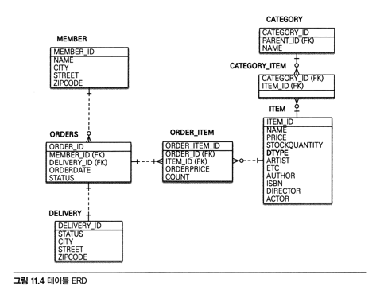

- 뷰: JPA, JSTL
- 웹계층: 스프링 MVC
- 데이터 저장 계층: JPA, 하이버네이트
- 기반 프레임워크: 스프링 프레임워크
- 빌드: 메이븐

# 11.1 프로젝트 환경설정
https://github.com/holyeye/jpabook/tree/master/ch11-jpa-shop 소스코드를 기준으로 설명
- mvn tomcat7:run 으로 localhost:8080 서버 실행

## 11.1.1 프로젝트 구조
```
❯ tree -d
jpashop : 루트
├── pom.xml : 메이븐 설정
├── src : 소스
│   ├── main : 실행코드
│   │   ├── java : 자바코드
│   │   ├── resources : 리소스
│   │   └── webapp : 웹폴더
│   └── test : 테스트 코드
│       └── java
└── target : 빌드 결과
```

## 메이븐과 사용 라이브러리 관리
```xml
<?xml version="1.0" encoding="UTF-8"?>
<project>
  <modelVersion>4.0.0</modelVersion>
  
  <groupId>jpabook</groupId> <!-- 프로젝트 그룹명 -->
  <artifactId>ch11-jpa-shop</artifactId> <!-- 프로젝트 식별아이디 -->
  <version>1.0-SNAPSHOT</version> <!-- 프로젝트 버전 -->
  <name>jpa-shop</name> <!-- 프로젝트 이름 -->
  <packaging>war</packaging> <!-- 패키징 방법 -->
  
  <dependencies> <!-- 사용할 라이브러리 -->
  <!--   생략   -->
  </dependencies>

  <build> <!-- 빌드 관련 정보 -->
  <!--   생략   -->
  </build>
</project>
```
- spring-webmvc: 스프링 MVC
- spring-orm: JPA연동
- hibernate-entitymanager: 하이버네이트
  - hibernate-cor
  - hibernate-jpa
  
## 11.1.3 스프링 프레임워크 설정
```
main
├── java
│   └── jpabook
│       └── jpashop
│           ├── domain : 도메인계층
│           ├── exception
│           ├── repository : 데이터 저장 계층
│           ├── service : 서비스 계층
│           └── web : 웹계층
├── resources
│   ├── appConfig.xml : 3. 스프링 애플리케이션 관련 설정
│   └── webAppConfig.xml : 2. 스프링 웹 관련 설정
└── webapp
    ├── WEB-INF
       └── web.xml : 1. 웹 애플리케이션 환경설정 파일
```

### web.xml
```xml
<?xml version="1.0" encoding="UTF-8" standalone="no"?>
<web-app>
    <context-param>
        <param-name>contextConfigLocation</param-name>
        <param-value>classpath:appConfig.xml</param-value>
    </context-param>

    <servlet>
        <servlet-name>dispatcher</servlet-name>
        <servlet-class>org.springframework.web.servlet.DispatcherServlet</servlet-class>
        <init-param>
            <param-name>contextConfigLocation</param-name>
            <param-value>classpath:webAppConfig.xml, classpath:appConfig.xml</param-value>
        </init-param>
        <load-on-startup>1</load-on-startup>
    </servlet>
</web-app>
```
- appConfig.xml: 비지니스 로직, 도메인 계층, 서비스 계층, 데이터 저장 계층을 담당
- webAppConfig.xml: 웹 계층 담당

```xml
<?xml version="1.0" encoding="UTF-8"?> <!-- webAppConfig.xml -->
<beans>

  <!-- 스프링 mvc 기능 활성화 -->
  <mvc:annotation-driven/>

  <!-- 패키지 하위를 검색해 @Component, @Service 등의 스프링 빈을 찾아 등록 -->
  <context:component-scan base-package="jpabook.jpashop.web"/>


  <!-- 빈 등록 -->
  <bean id="viewResolver" class="org.springframework.web.servlet.view.InternalResourceViewResolver">
      <property name="viewClass" value="org.springframework.web.servlet.view.JstlView"/>
      <property name="prefix" value="/WEB-INF/jsp/"/>
      <property name="suffix" value=".jsp"/>
  </bean>
</beans>
```

```xml
<?xml version="1.0" encoding="UTF-8"?> <!-- appConfig.xml -->
<beans>
<!--  어노테이션 기반 트랜잭션 관리자를 활성화 (@Transactional)-->
  <tx:annotation-driven/>

  <context:component-scan base-package="jpabook.jpashop.service, jpabook.jpashop.repository"/>

<!--  데이터 베이스에 접근할 데이터소스 등록 -->
  <bean id="dataSource" class="org.apache.tomcat.jdbc.pool.DataSource">
      <property name="driverClassName" value="org.h2.Driver"/>
      <property name="url" value="jdbc:h2:mem:jpashop"/> <!-- 인메모리 -->
      <property name="username" value="sa"/>
      <property name="password" value=""/>
  </bean>

<!--
  트랜잭션 관리자 등록
  JpaTransactionManager: DataSourceTransactionManager + JPA 기능을 수행하는 매니저
-->
  <bean id="transactionManager" class="org.springframework.orm.jpa.JpaTransactionManager">
      <property name="dataSource" ref="dataSource"/>
  </bean>

  <!-- JPA 예외를 스프링 예외로 변환: Repository에 AOP로 변환한다. -->
  <bean class="org.springframework.dao.annotation.PersistenceExceptionTranslationPostProcessor"/>

<!--
  LocalContainerEntityManagerFactoryBean을 스프링 빈으로 등록하면 JPA를 사용할 수 있다.
  persistence.xml 에서 하는 설정을 여기서 다 할 수 있다.
  - persistenceUnitName을 지정하지 않으면 default로 사용
-->
  <bean id="entityManagerFactory" class="org.springframework.orm.jpa.LocalContainerEntityManagerFactoryBean">
      <property name="dataSource" ref="dataSource"/>
      <property name="packagesToScan" value="jpabook.jpashop.domain"/> <!-- @Entity 탐색 시작 위치 -->
      <property name="jpaVendorAdapter"> <!-- JPA 벤더사용 -->
          <!-- 하이버네이트 구현체 사용 -->
          <bean class="org.springframework.orm.jpa.vendor.HibernateJpaVendorAdapter"/>
      </property>
      <property name="jpaProperties"> <!-- 하이버네이트 상세 설정 -->
          <props>
              <prop key="hibernate.dialect">org.hibernate.dialect.H2Dialect</prop> <!-- 방언 -->
              <prop key="hibernate.show_sql">true</prop>                   <!-- SQL 보기 -->
              <prop key="hibernate.format_sql">true</prop>                 <!-- SQL 정렬해서 보기 -->
              <prop key="hibernate.use_sql_comments">true</prop>           <!-- SQL 코멘트 보기 -->
              <prop key="hibernate.id.new_generator_mappings">true</prop>  <!-- 새 버전의 ID 생성 옵션 -->
              <prop key="hibernate.hbm2ddl.auto">create</prop>             <!-- DDL 자동 생성 -->
          </props>
      </property>
  </bean>
</beans>
```

# 11.2 도메인 모델과 테이블 설계

### 11.2.1 요구사항 분석

- 회원기능
  - 회원등록
  - 회원조회
- 상품기능
  - 상품등록
  - 상품수정
  - 상품조회
- 주문기능
  - 상품주문
  - 주문내역 조회
  - 주문취소
- 기타 요구사항
  - 상품의 종류: 도서, 음반, 영화
  - 카테고리로 구분할 수 있다.
  - 주문시 배송정보를 입력할 수 있다.

### 11.2.2 도메인 모델 설계


### 11.2.3 테이블 설계


### 11.2.4 연관관계 정리
- 회원과 주문: 일대다 양방향
- 주문상품과 주문: 다대일 양방향
- 주문상품과 상품: 다대일 단방향
- 주문과 배송: 일대일 양방향
- 카테고리와 상품: 다대다 (매핑 소개를 위해 사용)

### 11.2.5 엔티티 클래스
- 소스코드 참조 (https://github.com/holyeye/jpabook/tree/master/ch11-jpa-shop/src/main/java/jpabook/jpashop/domain)

# 11.3 애플리케이션 구현
- JPA 설명을 위해 핵심기능만 구현

## 11.3.1 개발방법


## 11.3.2 회원기능

### 회원 리포지토리
```java
@Repository
public class MemberRepository {

    @PersistenceContext
    EntityManager em;

    public void save(Member member) {
        em.persist(member);
    }

    public Member findOne(Long id) {
        return em.find(Member.class, id);
    }

    public List<Member> findAll() {
        return em.createQuery("select m from Member m", Member.class)
                .getResultList();
    }

    public List<Member> findByName(String name) {
        return em.createQuery("select m from Member m where m.name = :name", Member.class)
                .setParameter("name", name)
                .getResultList();
    }
}
```
- @Repository: 어노테이션이 있으면 component-scan에 의해 스프링 빈으로 자동등록된다.
  - NoResultException -> EmptyResultDataAccessException으로 변환한다.
- @PersistenceContext: 컨테이너가 관리하는 엔티티 메니저를 주입
- @PersistenceUnit: 엔티티 매니저 팩토리 주입

### 회원 서비스
```java
@Service
@Transactional
public class MemberService {

    @Autowired
    MemberRepository memberRepository;

    public Long join(Member member) {
        validateDuplicateMember(member); //중복 회원 검증
        memberRepository.save(member);
        return member.getId();
    }

    private void validateDuplicateMember(Member member) {
        List<Member> findMembers = memberRepository.findByName(member.getName());
        if (!findMembers.isEmpty()) {
            throw new IllegalStateException("이미 존재하는 회원입니다.");
        }
    }

    public List<Member> findMembers() {
        return memberRepository.findAll();
    }

    public Member findOne(Long memberId) {
        return memberRepository.findOne(memberId);
    }
}
```
- @Service: component-scan에 의해 스프링 빈으로 자동등록
- @Transactional: 클래스나 메소드에 트랜잭션을 적용한다. 메소드 호출할때 트랜잭션시작, 종료할때 트랜잭션커밋, 예외 발생시 트랜잭션 롤백
- @Autowired: 적절한 스프링 빈 주입

### 회원 가입 테스트
```java
@RunWith(SpringJUnit4ClassRunner.class) // junit과 스프링 프레임워크와 통합
@ContextConfiguration(locations = "classpath:appConfig.xml") // 스프링 설정정보 지정
@Transactional // 테스트에서는 각 테스트 실행시 트랜잭션시작, 종료시 트랜잭션 롤백!!
public class MemberServiceTest {

  @Autowired MemberService memberService;
  @Autowired MemberRepository memberRepository;

  @Test
  public void 회원가입() throws Exception {
    //Given
    Member member = new Member();
    member.setName("kim");

    //When
    Long saveId = memberService.join(member);

    //Then
    assertEquals(member, memberRepository.findOne(saveId));
  }

  @Test(expected = IllegalStateException.class) // 지정한 예외가 발생해야 테스트 성공
  public void 중복_회원_예외() throws Exception {
    //Given
    Member member1 = new Member();
    member1.setName("kim");

    Member member2 = new Member();
    member2.setName("kim");

    //When
    memberService.join(member1);
    memberService.join(member2); //예외가 발생해야 한다.

    //Then
    fail("예외가 발생해야 한다.");
  }
}
```

## 11.3.3 상품 기능
```java
@Entity
@Inheritance(strategy = InheritanceType.SINGLE_TABLE)
@DiscriminatorColumn(name = "DTYPE")
public abstract class Item {

  @Id @GeneratedValue
  @Column(name = "ITEM_ID")
  private Long id;

  private String name;        //이름
  private int price;          //가격
  private int stockQuantity;  //재고수량

  @ManyToMany(mappedBy = "items")
  private List<Category> categories = new ArrayList<Category>();

  //==Biz Method==//
  public void addStock(int quantity) {
    this.stockQuantity += quantity;
  }

  public void removeStock(int quantity) {
    int restStock = this.stockQuantity - quantity;
    if (restStock < 0) {
      throw new NotEnoughStockException("need more stock");
    }
    this.stockQuantity = restStock;
  }
}
```
- 재고 관리용 비지니스 로직을 포함한다. (addStock, removeStock)

```java
@Repository
public class ItemRepository {

    @PersistenceContext
    EntityManager em;

    public void save(Item item) {
        if (item.getId() == null) {
            em.persist(item);
        } else {
            em.merge(item);
        }
    }
}
```
- save 하나로 저장, 수정을 모두 처리

```java
@Service
@Transactional
public class ItemService {

    @Autowired
    ItemRepository itemRepository;

    public void saveItem(Item item) {
        itemRepository.save(item);
    }

    public List<Item> findItems() {
        return itemRepository.findAll();
    }

    public Item findOne(Long itemId) {
        return itemRepository.findOne(itemId);
    }
}
```

## 11.3.4 주문 기능
```java
@Entity
@Table(name = "ORDERS")
public class Order {

    @Id @GeneratedValue
    @Column(name = "ORDER_ID")
    private Long id;

    @ManyToOne(fetch = FetchType.LAZY)
    @JoinColumn(name = "MEMBER_ID")
    private Member member;      //주문 회원

    @OneToMany(mappedBy = "order", cascade = CascadeType.ALL)
    private List<OrderItem> orderItems = new ArrayList<OrderItem>();

    @OneToOne(cascade = CascadeType.ALL, fetch = FetchType.LAZY)
    @JoinColumn(name = "DELIVERY_ID")
    private Delivery delivery;  //배송정보

    private Date orderDate;     //주문시간

    @Enumerated(EnumType.STRING)
    private OrderStatus status;//주문상태

    //==생성 메서드==//
    public static Order createOrder(Member member, Delivery delivery, OrderItem... orderItems) {
        Order order = new Order();
        order.setMember(member);
        order.setDelivery(delivery);
        for (OrderItem orderItem : orderItems) {
            order.addOrderItem(orderItem);
        }
        order.setStatus(OrderStatus.ORDER);
        order.setOrderDate(new Date());
        return order;
    }

    //==비즈니스 로직==//
    /** 주문 취소 */
    public void cancel() {
        if (delivery.getStatus() == DeliveryStatus.COMP) {
            throw new RuntimeException("이미 배송완료된 상품은 취소가 불가능합니다.");
        }

        this.setStatus(OrderStatus.CANCEL);
        for (OrderItem orderItem : orderItems) {
            orderItem.cancel();
        }
    }

    //==조회 로직==//
    /** 전체 주문 가격 조회 */
    public int getTotalPrice() {
        int totalPrice = 0;
        for (OrderItem orderItem : orderItems) {
            totalPrice += orderItem.getTotalPrice();
        }
        return totalPrice;
    }
}
```

```java
@Entity
@Table(name = "ORDER_ITEM")
public class OrderItem {
    @Id @GeneratedValue
    @Column(name = "ORDER_ITEM_ID")
    private Long id;

    @ManyToOne(fetch = FetchType.LAZY)
    @JoinColumn(name = "ITEM_ID")
    private Item item;      //주문 상품

    @ManyToOne(fetch = FetchType.LAZY)
    @JoinColumn(name = "ORDER_ID")
    private Order order;    //주문

    private int orderPrice; //주문 가격
    private int count;      //주문 수량

    //==생성 메서드==//
    public static OrderItem createOrderItem(Item item, int orderPrice, int count) {
        OrderItem orderItem = new OrderItem();
        orderItem.setItem(item);
        orderItem.setOrderPrice(orderPrice);
        orderItem.setCount(count);

        item.removeStock(count); // 상품 재고를 줄임
        return orderItem;
    }

    //==비즈니스 로직==//
    /** 주문 취소 */
    public void cancel() {
        getItem().addStock(count); // 재고를 증가시킴
    }

    //==조회 로직==//
    /** 주문상품 전체 가격 조회 */
    public int getTotalPrice() {
        return getOrderPrice() * getCount();
    }
}
```

```java
@Service
@Transactional
public class OrderService {

  @Autowired MemberRepository memberRepository;
  @Autowired OrderRepository orderRepository;
  @Autowired ItemService itemService;

  /** 주문 */
  public Long order(Long memberId, Long itemId, int count) {
    //엔티티 조회
    Member member = memberRepository.findOne(memberId);
    Item item = itemService.findOne(itemId);

    //배송정보 생성
    Delivery delivery = new Delivery(member.getAddress());
    //주문상품 생성
    OrderItem orderItem = OrderItem.createOrderItem(item, item.getPrice(), count);
    //주문 생성
    Order order = Order.createOrder(member, delivery, orderItem);

    //주문 저장
    orderRepository.save(order);
    return order.getId();
  }


  /** 주문 취소 */
  public void cancelOrder(Long orderId) {
    //주문 엔티티 조회
    Order order = orderRepository.findOne(orderId);
    //주문 취소
    order.cancel();
  }

  /** 주문 검색 */
  public List<Order> findOrders(OrderSearch orderSearch) {
    return orderRepository.findAll(orderSearch);
  }
}
```
- 비지니스 로직 대부분이 엔티티에 있다. 이를 도메인 모델 패턴이라고 한다.
  - 반대로 서비스 계층에서 대부분의 비지니스 로직을 처리하는 것을 트랜잭션 스크립트 패턴이라고 한다.

```java
public class OrderSearch {
    private String memberName;      //회원 이름
    private OrderStatus orderStatus;//주문 상태
}

@Repository
public class OrderRepository {

    @PersistenceContext
    EntityManager em;

    public void save(Order order) {
        em.persist(order);
    }

    public Order findOne(Long id) {
        return em.find(Order.class, id);
    }

    public List<Order> findAll(OrderSearch orderSearch) {

        CriteriaBuilder cb = em.getCriteriaBuilder();
        CriteriaQuery<Order> cq = cb.createQuery(Order.class);
        Root<Order> o = cq.from(Order.class);

        List<Predicate> criteria = new ArrayList<Predicate>();

        //주문 상태 검색
        if (orderSearch.getOrderStatus() != null) {
            Predicate status = cb.equal(o.get("status"), orderSearch.getOrderStatus());
            criteria.add(status);
        }
        //회원 이름 검색
        if (StringUtils.hasText(orderSearch.getMemberName())) {
            Join<Order, Member> m = o.join("member", JoinType.INNER); //회원과 조인
            Predicate name = cb.like(m.<String>get("name"), "%" + orderSearch.getMemberName() + "%");
            criteria.add(name);
        }

        cq.where(cb.and(criteria.toArray(new Predicate[criteria.size()])));
        TypedQuery<Order> query = em.createQuery(cq).setMaxResults(1000); //최대 검색 1000 건으로 제한
        return query.getResultList();
    }
}
```


```java
@RunWith(SpringJUnit4ClassRunner.class)
@ContextConfiguration(locations = "classpath:appConfig.xml")
@Transactional
public class OrderServiceTest {
    @PersistenceContext
    EntityManager em;

    @Autowired OrderService orderService;
    @Autowired OrderRepository orderRepository;

    @Test
    public void 상품주문() throws Exception {
        //Given
        Member member = createMember();
        Item item = createBook("시골 JPA", 10000, 10); //이름, 가격, 재고
        int orderCount = 2;

        //When
        Long orderId = orderService.order(member.getId(), item.getId(), orderCount);

        //Then
        Order getOrder = orderRepository.findOne(orderId);

        assertEquals("상품 주문시 상태는 주문(ORDER)이다.", OrderStatus.ORDER, getOrder.getStatus());
        assertEquals("주문한 상품 종류 수가 정확해야 한다.", 1, getOrder.getOrderItems().size());
        assertEquals("주문 가격은 가격 * 수량이다.", 10000 * 2, getOrder.getTotalPrice());
        assertEquals("주문 수량만큼 재고가 줄어야 한다.", 8, item.getStockQuantity());
    }

    @Test(expected = NotEnoughStockException.class)
    public void 상품주문_재고수량초과() throws Exception {
        //Given
        Member member = createMember();
        Item item = createBook("시골 JPA", 10000, 10); //이름, 가격, 재고

        int orderCount = 11; //재고 보다 많은 수량

        //When
        orderService.order(member.getId(), item.getId(), orderCount); // order내 item.removeStock에서 exception이 발생한다.

        //Then
        fail("재고 수량 부족 예외가 발생해야 한다.");
    }


    @Test
    public void 주문취소() {
        //Given
        Member member = createMember();
        Item item = createBook("시골 JPA", 10000, 10); //이름, 가격, 재고
        int orderCount = 2;

        Long orderId = orderService.order(member.getId(), item.getId(), orderCount);

        //When
        orderService.cancelOrder(orderId);

        //Then
        Order getOrder = orderRepository.findOne(orderId);

        assertEquals("주문 취소시 상태는 CANCEL 이다.", OrderStatus.CANCEL, getOrder.getStatus());
        assertEquals("주문이 취소된 상품은 그만큼 재고가 증가해야 한다.", 10, item.getStockQuantity());
    }

    private Member createMember() {
        Member member = new Member();
        member.setName("회원1");
        member.setAddress(new Address("서울", "강가", "123-123"));
        em.persist(member);
        return member;
    }

    private Book createBook(String name, int price, int stockQuantity) {
        Book book = new Book();
        book.setName(name);
        book.setStockQuantity(stockQuantity);
        book.setPrice(price);
        em.persist(book);
        return book;
    }
}
```

## 11.3.5 웹 계층 구현
```java
@Controller
public class ItemController {
  @Autowired
  ItemService itemService;

  @RequestMapping(value = "/items/new", method = RequestMethod.GET)
  public String createForm() {
    return "items/createItemForm"; // 뷰 리졸버가 이 정보를 바탕으로 실행할 뷰를 찾는다.
  }

  @RequestMapping(value = "/items/new", method = RequestMethod.POST)
  public String create(Book item) {
    itemService.saveItem(item);
    return "redirect:/items";
  }

  @RequestMapping(value = "/items", method = RequestMethod.GET)
  public String list(Model model) {
    List<Item> items = itemService.findItems();
    model.addAttribute("items", items);
    return "items/itemList";
  }
}
```
- 뷰리졸버가 items/createItemForm -> (prefix)items/createItemForm(postfix) 로 변경하여 뷰를 찾는다.
  - /WEB-INF/jsp/items/createItemForm.jsp
- 상품 등록을 완료한 후에 "/items"로 리다이렉트한다. ("redirect:/items")
- 상품 목록은 조회한 상품을 뷰에 전달하기 위해서 MVC가 제공하는 모델 객체에 담아두고 뷰이름을 반환한다.

```html
<%@ taglib prefix="c" uri="http://java.sun.com/jsp/jstl/core" %>
<%@ page contentType="text/html;charset=UTF-8" language="java" %>
<!DOCTYPE html>
<html>
<jsp:include page="../fragments/head.jsp"/>
<body>

<div class="container">
    <jsp:include page="../fragments/bodyHeader.jsp" />

    <div>
        <table class="table table-striped">
            <thead>
            <tr>
                <th>#</th>
                <th>상품명</th>
                <th>가격</th>
                <th>재고수량</th>
                <th></th>
            </tr>
            </thead>
            <tbody>
            <c:forEach items="${items}" var="item">
                <tr>
                    <td>${item.id}</td>
                    <td>${item.name}</td>
                    <td>${item.price}</td>
                    <td>${item.stockQuantity}</td>
                    <td>
                        <a href="/items/${item.id}/edit" class="btn btn-primary" role="button">수정</a>
                    </td>
                </tr>
            </c:forEach>
            </tbody>
        </table>
    </div>

    <jsp:include page="../fragments/footer.jsp" />

</div> <!-- /container -->
</body>
</html>
```
- 모델에 넘겨준 items를 꺼내서 정보를 출력한다.

```java
@Controller
public class ItemController {
    @Autowired ItemService itemService;

    /**
     * 상품 수정 폼
     */
    @RequestMapping(value = "/items/{itemId}/edit", method = RequestMethod.GET)
    public String updateItemForm(@PathVariable("itemId") Long itemId, Model model) {
        Item item = itemService.findOne(itemId);
        model.addAttribute("item", item);
        return "items/updateItemForm";
    }

    /**
     * 상품 수정
     */
    @RequestMapping(value = "/items/{itemId}/edit", method = RequestMethod.POST)
    public String updateItem(@ModelAttribute("item") Book item) {
        itemService.saveItem(item);
        return "redirect:/items";
    }
}
```
- 상품 수정 폼에서 submit을 하면 updateItem이 호출되는데 파라미터로 넘어온 item 은 준영속상태다.

### 변경감지와 병합
- 변경감지를 사용하는 방법은 영속성 컨텍스트에서 엔티티를 다시 조회한 후에 수정
- 변경감지를 사용하면 원한느 속성만 선택해서 변경할 수 있지만 병합은 모든 속성이 변경된다.

```java
@Controller
public class OrderController {
    @Autowired OrderService orderService;
    @Autowired MemberService memberService;
    @Autowired ItemService itemService;

    @RequestMapping(value = "/order", method = RequestMethod.GET)
    public String createForm(Model model) {
        List<Member> members = memberService.findMembers();
        List<Item> items = itemService.findItems();
        model.addAttribute("members", members);
        model.addAttribute("items", items);
        return "order/orderForm";
    }

    @RequestMapping(value = "/order", method = RequestMethod.POST)
    public String order(@RequestParam("memberId") Long memberId, @RequestParam("itemId") Long itemId, @RequestParam("count") int count) {
        orderService.order(memberId, itemId, count);
        return "redirect:/orders";
    }

    @RequestMapping(value = "/orders/{orderId}/cancel")
    public String processCancelBuy(@PathVariable("orderId") Long orderId) {
        orderService.cancelOrder(orderId);
        return "redirect:/orders";
    }
}
```

# 11.4 정리
- 뷰에서 지연로딩을 지원하기 위해 OSIV를 사용했는데 이는 13장에서 다룬다.
