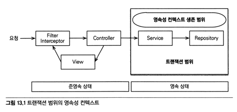
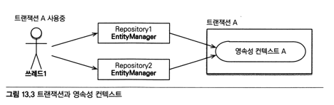
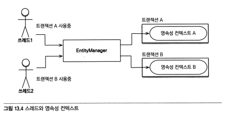
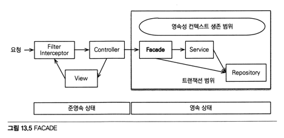
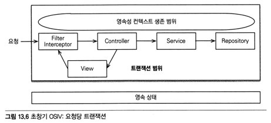
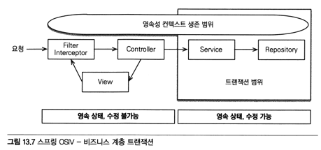
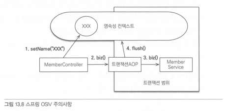

# 13.1 트랜잭션 범위의 영속성 컨텍스트
- 순수하게 J2SE 환경에서 JPA를 사용하면 직접 관리해야하나 스프링 혹은 J2EE 환경에서 사용하면 컨테이너가 제공하는 전략을 따라야 한다.

## 13.1.1 스프링 컨테이너의 기본 전략
- 스프링 컨테이너: 트랜잭션 범위의 영속성 컨텍스트 전략
  - 트랜잭션이 시작할때 영속성 컨텍스트를 생성하고 끝날때 영속성 컨텍스트를 종료한다.
  - 같은 트랜잭션 안에서는 같은 영속성 컨텍스트에 접근한다.



```kotlin
@Controller
class HelloController(val helloService: HelloService) {
  fun hello() {
    // 4. member는 준영속 상태다
    val member = helloService.logic()
  }
}

@Service
class HelloService(
  @Autowired private val repository1: Repository1,
  @Autowired private val repository2: Repository2,
) {
  @PersistenceContext
  var em: EntityManager
  
  // 1. 트랜잭션 시작
  @Transactional
  fun logic() {
    repository1.hello()
    // 2. member는 영속상태
    val member = repository2.findMember()
    return member
  }
  // 3. 트랜잭션 종료
}

@Repository
class Repository1 {
  @PersistenceContext
  var em: EntityManager
  fun hello() {
    em.xxx() // A. 영속성 컨텍스트 접근
  }
}

@Repository
class Repository2 {
  @PersistenceContext
  var em: EntityManager
  fun findMember(): Member {
    return em.find(Member::class.java, "id1") // B. 영속성 컨텍스트 접근
  }
}
```
1. helloService.logic() 메소드 호출할때 트랜잭션이 시작된다.
2. repository2.findMember()로 조회한 member 엔티티는 영속상태
3. 메소드가 종료되면서 트랜잭션이 종료되고 영속성 컨텍스트도 종료된다.
4. memberController.hello() 에서 넘겨받은 member 엔티티는 준영속 상태가 된다.


- 트랜잭션이 같으면 같은 영속성 컨텍스트를 사용


- 트랜잭션이 다르면 다른 영속성 컨텍스트를 사용

# 13.2 준영속 상태와 지연로딩
```kotlin
@Entity
class Order(
  @Id
  val id: Long,
  @ManyToOne(fetch = FetchType.LAZY)
  val member: Member
)

class OrderController {
  fun view(orderId: Long) {
    val order = orderService.findOne(orderId)
    val member = order.member
    val name = member.name // 지연로딩으로 예외 발생
  }
}
```
- service 계층부터 트랜잭션을 설정하면 프리젠테이션 계층에서는 준영속 상태다.
- 지연로딩 설정시 member.name에서 지연로딩을 시도하고 이때 예외가 발생한다.

준영속상태로 인한 문제
- 프리젠테이션 계층에서 준영속상태가 되어 변경감지가 동작하지 않는데 비지니스 로직이 서비스 계층에 있으므로 큰 문제가 되지 않는다.
- 프록시 객체를 사용하면 초기화를 하려고 하는데 준영속 상태에서는 동작하지 않는다.  
  => 뷰가 필요한 엔티티를 미리 로드하거나 OSIV를 사용해 엔티티를 항상 영속상태로 유지한다.

## 13.2.1 글로벌 페치 전략 수정
- FetchType.EAGER를 설정해서 뷰에서 필요한 엔티티를 미리 로드한다.
  - 사용하지 않는 엔티티를 로딩
  - N+1 문제가 발생: JPQL로 조회시 연관된 엔티티 조회를 위해 요청이 N번만큼 발생한다. (해결방법을 15.4.1에서 다룬다)

## 13.2.2 JPQL 페치조인
- 글로벌 페치 전략은 너무 비효율적이므로 페치조인을 사용해 JPQL 호출시점에 로딩할 엔티티를 선택한다.
  - 화면에 맞춘 리포지토리 메소드가 증가할 수 있다. (프리젠테이션 계층이 데이터 접근 계층을 침범)

## 13.2.3 강제로 초기화
- 영속성 컨텍스트가 살아있을때 프리젠테이션 계층이 필요한 엔티티를 강제로 초기화할 수 있다.
- 하이버네이트에서는 initialize()로 할 수 있다.
  - 비지니스로직이 프리젠테이션을 위한 일을 하게 된다. -> FACADE 계층이 이를 담당

## 13.2.4 FACADE 계층 추가

- 프리젠테이션 계층과 도메인 모델 계층 간의 논리적 의존성을 분리해준다.
- 프리젠테이션 계층에서 필요한 프록시 객체를 초기화해준다.
- 서비스 계층을 호출해서 비지니스 로직을 실행한다.
- 리포지토리를 직접 호출해서 뷰가 요구하는 엔티티를 찾는다.

```kotlin
class OrderFacade(
  val orderService: OrderService
) {
  fun findOrder(id: Long) {
    val order = orderService.findOne(id)
    order.member.name
    return order
  }
}
```
- FACADE는 중간에 끼어든 계층이다.
- 단순히 서비스 계층을 호출만 하는 위임코드만 있게 된다.

## 13.2.5 준영속 상태와 지연 로딩의 문제점
- 여러방법을 찾아봤지만 실수가 발생할 여지가 있고 번거롭다.
- 엔티티를 계속 영속상태 열어두자. 그 방법이 OSIV다. 

# 13.3 OSIV
- OSIV: Open Session In View
  - 하이버네이트에서의 용어.
  - JPA에서는 OEIV(Open EntityManager In View)

## 13.3.1 과거 OSIV: 요청 당 트랜잭션

- 문제는 뷰가 엔티티를 변경할 수 있게 된다는 것이다.
- 뷰에서 필요에 의해 잠시 데이터를 바꾸면 실제 DB에서 데이터가 바뀌어 버린다.


### 엔티티를 읽기 전용 인터페이스로 제공
```java
interface MemberView {
    public String getName();
}

class Member implements MemberView { }

class MemberService {
    public MemberView getMember(Long id) {
        return memberRespository.findById(id);
    }
}
```
- setter가 없는 인터페이스로 제공

### 엔티티 래핑
```java
class MemberWrapper {
  private Member member;
  public MemberWrapper(Member member) { this.member = member; }
  public String getName() { return member.getName(); }
}
```
- MemberWrapper처럼 get만 가능한 wrapper를 제공

### DTO 반환
- DTO 클래스를 만들어 데이터를 복제해서 사용하는 방법이다.

### 문제점
- 설명한 방법 모두 코드량이 상당히 증가한다.
- 스프링 프레임워크는 비지니스 계층에서 트랜잭션을 유지하는 OSIV를 제공한다.

## 13.3.2 스프링 OSIV: 비지니스 계층 트랜잭션

1. 클라이언트 요청시 서블릿필터나 스프링 인터셉터에서 영속성 컨텍스트 생성
2. 서비스 계층에서 트랜잭션 시작할때 미리 생성해둔 영속성 컨텍스트 사용
3. 트랜잭션 커밋시 영속성 컨텍스트 플러시. 트랜잭션 종료후 영속성 컨텍스트 종료 안함
4. 뷰에서 영속성 컨텍스트 사용
5. 서블릿필터나 스프링 인터셉터로 요청이 돌아오면 영속성 컨텍스트 종료. (플러시 안함)

### 트랜잭션 없이 읽기
트랜잭션없이 변경을 하면 예외가 발생하지만 읽기는 가능하다.

### 스프링 OSIV 주의사항
- 프리젠테이션 계층에서 엔티티를 수정해도 수정내용을 DB에 반영하지 않는다.
- 이때 엔티티 수정 후 트랜잭션을 시작하는 서비스 계층을 호출하면 문제가 발생한다.


- 스프링 OSIV는 같은 영속성 컨텍스트를 여러 트랜잭션이 공유해서 문제가 발생한다.
- OSIV를 사용하지 않는 상황에서는 이런 문제가 발생하지 않는다.

## 13.3.3 OSIV 정리
- 스프링 OSIV의 단점
  - 프리젠테이션 계층에서 지연로딩에 의해 SQL이 실행된다. 성능 튜닝시 확인해야할 부분이 넓다.
- OSIV는 만능이 아니다. 복잡한 데이터의 경우 JPQL로 DTO를 생성하는 것이 더 나은 해결책일 수 있다.
- 클라이언트에서 사용하기 위해서는 지연로딩을 사용할 수 없다. 결국 모두 변환을 해야한다.
- 엔티티는 생각보다 자주 변경되므로 API를 위해서는 DTO를 사용하자.

# 13.4 너무 엄격한 계층
- OSIV를 사용하면 영속성 컨텍스트가 살아 있으므로 컨트롤러에서 간단한 조회를 직접해도 문제가 없다.
- EJB 시절에는 프리젠테이션 계층에 엔티티를 직접 반환하면 문제가 발생해 DTO를 사용했는데 OSIV를 사용하면 좀 더 유영낳게 사용해도 된다.
