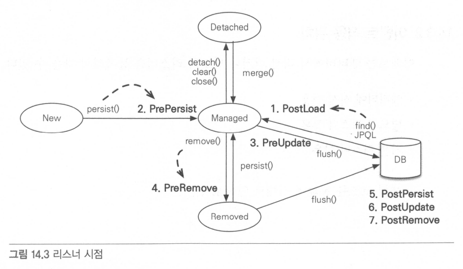

# 14.1 컬렉션
JPA는 자바에서 제공하는 Collection, List, Set, Map 컬렉션을 지원한다.
- @OneToMany, @ManyToMany 연관관계
- @ElementCollection 값 타입

JPA에는 컬렉션 인터페이스에 대한 언급이 없어 구현체에 따라 제공하는 기능이 다를 수 있다.

## 14.1.1 JPA와 컬렉션
```kotlin
@Entity(name = "ch14Team")
class Team(
  @Id @GeneratedValue
  val id: Long? = null,
  @OneToMany
  @JoinColumn
  val members: MutableCollection<Member> = mutableListOf()
)

@Entity(name = "ch14Member")
class Member(
  @Id @GeneratedValue
  val id: Long? = null
)

val team = Team()
log(team.members.javaClass.name) // java.util.ArrayList
em.persist(team)
log(team.members.javaClass.name) // org.hibernate.collection.internal.PersistentBag
```
- ArrayList가 PersistentBag으로 변경되었다.
- 하이버네이트는 원본 컬렉션을 감싸고 있는 내장 컬렉션을 생성해서 이를 사용하도록 한다. 래퍼 컬렉션으로도 부른다.

```java
// org.hibernate.collection.internal.PersistentBag
@OneToMany
Collection<Member> collection = new ArrayList<Member>();

// org.hibernate.collection.internal.PersistentBag
@OneToMany
List<Member> list = new ArrayList<Member>();

// org.hibernate.collection.internal.PersistentSet
@OneToMany
Set<Member> set = new HashSet<Member>();

// org.hibernate.collection.internal.PersistentList
@OneToMany @OrderColumn
List<Member> orderColumnList = new ArrayList<Member>();
```
- 인터페이스에 따라 다른 내장 컬렉션이 사용된다.

## 14.1.2 Collection, List
- 중복을 허용하고 PersistentBag를 래퍼로 사용한다.
- add는 항상 true를 반환하고, 찾을때는 equals를 사용
- 엔티티를 추가할때 중복된 엔티티가 있는지 비교하지 않고 저장하므로 지연로딩된 컬렉션을 초기화하지 않는다.

## 14.1.3 Set
- 중복을 허용하지 않고 PersistentSet을 래퍼로 사용한다.
- add로 객체를 추가할때마다 equals로 같은 객체가 있는지 비교한다.
  - 추가하면 true, 실패하면 false를 반환한다.
- HashSet은 해시알고리즘을 사용하므로 hashcode도 함께 사용해서 비교한다.
- 엔티티를 추가할때 중복된 엔티티가 있는지 비교하므로 지연로딩된 컬렉션을 초기화한다.

## 14.1.4 List + @OrderColumn
- List에 @OrderColumn을 추가하면 순서가 있는 컬렉션으로 인식한다.
- 데이터베이스에 순서값을 저장해 조회할때 사용한다.

```kotlin
@Entity
class Board(
  @Id @GeneratedValue
  val id: Long? = null,

  val title: String = "",
  val content: String = "",

  @OneToMany(mappedBy = "board")
  @OrderColumn(name = "POSITION")
  val comments: MutableList<Comment> = mutableListOf()
)

@Entity
class Comment(
  @Id @GeneratedValue
  val id: Long? = null,

  val comment: String = "",

  @ManyToOne
  @JoinColumn(name = "BOARD_ID")
  var board: Board? = null
)

fun addComment(em: EntityManager, board: Board, commentMessage: String) {
  val comment = Comment(comment = commentMessage)
  comment.board = board
  board.comments.add(comment)
  em.persist(comment)
}

fun testOrderColumn(em: EntityManager) {
  val board = Board(title = "제목1", content = "내용")
  em.persist(board)

  addComment(em, board, "댓글1") // POSITION = 0
  addComment(em, board, "댓글2") // POSITION = 1
  addComment(em, board, "댓글3") // POSITION = 2
  addComment(em, board, "댓글4") // POSITION = 3
}
```
- OrderColumn은 Board엔티티에서 매핑하므로 Comment에서는 POSITION 값을 알 수 없다.
- List를 변경하면 연관된 많은 위치값을 변경해야한다. 댓글2가 삭제되면 댓글3, 댓글4의 position을 줄이는 udpate sql이 실행된다.
- position값이 없으면 리스트에 null이 보관된다.

## 14.1.5 @OrderBy
- @OrderBy는 db의 order by를 사용해서 컬렉션을 정렬해 순서용 컬럼을 매핑하지 않아도 된다.
- 모든 컬렉션에 사용할 수 있다.
- Set에 사용할 경우 HashSet 대신 LinkedHashSet을 사용한다.

# 14.2 @Converter
- @Converter를 사용하면 엔티티의 데이터를 변환해서 db에 저장할 수 있다.

```kotlin
@Entity
class Member(
  @Id @GeneratedValue
  val id: Long? = null,
  @Convert(converter = BooleanToYNConverter::class)
  val vip: Boolean = false
)

@Converter
class BooleanToYNConverter: AttributeConverter<Boolean, String> {
  override fun convertToDatabaseColumn(attribute: Boolean?): String {
    return if (attribute != null && attribute) {
      "Y"
    } else {
      "N"
    }
  }

  override fun convertToEntityAttribute(dbData: String?): Boolean {
    return "Y" == dbData
  }
}
```
- @Convert를 사용하면 db에 저장하기 직전에 컨버터가 동작하도록 한다.
- 컨버터 클래스는 AttributeConverter를 구현한다.

```java
public interface AttributeConverter<X,Y> {
    public Y convertToDatabaseColumn (X attribute);
    public X convertToEntityAttribute (Y dbData);
}
```
- convertToDatabaseColumn: 엔티티 데이터 -> db
- convertToEntityAttribute: db -> 엔티티 데이터

```kotlin
@Entity
@Convert(converter = BooleanToYNConverter::class, attributeName = "vip")
class Member(
  @Id @GeneratedValue
  val id: Long? = null,
  val vip: Boolean = false
)
```
- 컨버터는 클래스 레벨에서도 설정할 수 있다.

## 14.2.1 글로벌 설정
모든 Boolean 타입에 컨버터를 적용하려면 autoApply 옵션을 적용한다.
```kotlin
@Converter(autoApply = true)
class BooleanToYNConverter: AttributeConverter<Boolean, String> { }
```

# 14.3 리스너
## 14.3.1 이벤트 종류

- PostLoad: 영속성 컨텍스트에 조회된 직후, refresh 호출 후
- PrePersist: 엔티티를 영속성 컨텍스트에 관리하기 직전에 호출. 식별자는 아직 없음. merge시에도 호출.
- PreUpdate: flush, commit으로 db에 수정하기 직전에 호출
- PreRemove: 영속성 컨텍스트에서 삭제하기 직전에 호출. 삭제명령어로 영속성 전이가 일어날때, orphanRemoval의 remove, commit시에도 호출
- PostPersist: db에 저장한 직후 호출
- PostUpdate: 엔티티를 db에서 수정한 직후
- PostRemove: 엔티티를 db에서 삭제한 직후

## 14.3.2 이벤트 적용 위치
### 엔티티에 직접 적용
```kotlin
@Entity
class Member {
  @PrePersist
  fun prePersist() {
    log("Member.prePersist id=${id}")
  }
}
```

### 별도의 리스너 등록
```kotlin
@Entity
@EntityListeners(MemberListener::class)
class Member

class MemberListener {
  @PrePersist
  fun prePersist(o: Any) {
    log("prePersist obj=${o}")
  }
}
```
- 리스너는 엔티티를 파라미터로 받을 수 있다.

### 기본 리스너 사용
```xml
<?xml version="1.0" encoding="UTF-8"?>
<entity-mappings xmlns="http://xmlns.jcp.org/xml/ns/persistence/orm" version="2.1">
  <persistence-unit-metadata>
    <persistence-unit-defaults>
      <entity-listeners>
        <entity-listener class="net.joostory.jpastudy.ch14.MemberListener" />
      </entity-listeners>
    </persistence-unit-defaults>
  </persistence-unit-metadata>
</entity-mappings>
```
- 여러리스너의 호출순서
  1. 기본 리스너
  2. 부모 클래스 리스너
  3. 리스너
  4. 엔티티

### 더 세밀한 설정
- @ExcludeDefaultListeners: 기본 리스너 무시 
- @ExcludeSuperclassListeners: 상위 클래스 이벤트 리스너 무시

# 14.4 엔티티 그래프
연관된 엔티티를 조회하려면 EAGER로 설정하거나 fetch join을 사용할 수 있다.
- 두 방법 모두 별도의 JPQL을 사용해야한다.
- 엔티티 그래프는 동일 JPQL로 연관된 엔티티를 조회할 수 있다.

## 14.4.1 Named 엔티티 그래프
```kotlin
@NamedEntityGraph(name="Order.withMember", attributeNodes = [NamedAttributeNode("member")])
@Entity
class Order(
  @ManyToOne(fetch = FetchType.LAZY, optional = false)
  val member: Member? = null
)
```
- attributeNodes에 함께 조회할 속성을 선택한다.
- 지연로딩으로 설정했지만 member도 함게 조회할 수 있다.

## 14.4.2 em.find()에서 엔티티 그래프 사용
```kotlin
val graph = em.getEntityGraph("Order.withMember")
val hints = mapOf<String, EntityGraph<Member>>("javax.persistence.fetchgraph" to graph)
val order = em.find(Order::class.java, hints)
```
- JPA 힌트 기능으로 javax.persistence.fetchgraph를 사용한다.

## 14.4.3 subgraph
- subgraph를 사용하면 Order -> OrderItem -> Item 까지 조회할 수 있다.

```kotlin
@NamedEntityGraph(
  name="Order.withAll",
  attributeNodes = [
    NamedAttributeNode("member"),
    NamedAttributeNode(value = "orderItems", subgraph = "orderItems")
  ],
  subgraphs = [
    NamedSubgraph(
      name = "orderItems",
      attributeNodes = [
        NamedAttributeNode("item")
      ]
    )
  ]
)
@Entity
class Order
```
- Order.withAll 이라는 Named 엔티티 그래프를 정의했다. 이는 다음과 같이 조회한다.
  - Order -> Member
  - Order -> OrderItem,
  - OrderItem -> Item

```kotlin
val graph: EntityGraph<*> = em.getEntityGraph("Order.withAll")
val order = em.find(Order::class.java, orderId, mapOf("javax.persistence.fetchgraph" to graph))
```

## 14.4.4 JPQL에서 엔티티 그래프 사용
```kotlin
val graph: EntityGraph<*> = em.getEntityGraph("Order.withAll")
val orderList = em.createQuery("select o from Order o where o.id = :orderId", Order::class.java)
    .setParameter("orderId", orderId)
    .setHint("javax.persistence.fetchgraph", graph)
    .resultList
```

## 14.4.5 동적 엔티티 그래프
```kotlin
val entityGraph = em.createEntityGraph(Order::class.java) // 엔티티 그래프 생성
entityGraph.addAttributeNodes("member")
val subgraph = entityGraph.addSubgraph<OrderItem>("orderItems") // subgraph 생성
subgraph.addAttributeNodes("items")
val order = em.find(Order::class.java, orderId, mapOf("javax.persistence.fetchgraph" to graph))
```

## 14.4.6 엔티티 그래프 정리
- ROOT 에서 시작해야한다.
- 이미 로딩된 엔티티는 엔티티 그래프가 적용되지 않는다.
- fetchgraph 힌트를 사용하면 선택한 속성만 조회, loadgraph 힌트를 사용하면 EAGER 타입으로 설정된 연관관계도 함께 조회한다.
