# 15.1 예외 처리
## 15.1.1 JPA 표준 예외 정리
- JPA의 표준 예외들은 javax.persistence.PersistenceException의 자식 클래스
- PersistenceException는 RuntimeException의 자식 클래스. 즉 JPA예외는 모두 언체크 예외다.

### JPA 표준 예외
- 트랜잭션 롤백을 표시하는 예외
  - 심각한 예외이므로 복구해선 안된다.
  - 트랜잭션을 강제로 커밋해도 커밋되지 않도 RollbackException이 발생한다.
  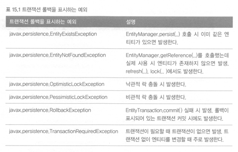
- 트랜잭션 롤백을 표시하지 않는 예외
  - 심각한 예외가 아니므로 개발자가 커밋할지 롤백할지 판단하면 된다.
  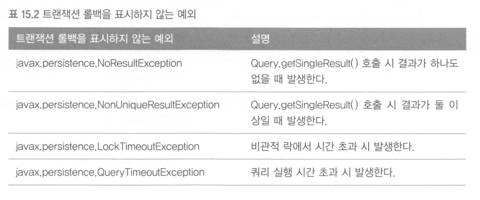

## 15.1.2 스프링 프레임워크의 JPA 예외 변환
서비스 계층에서 데이터 접근 계층의 구현기술에 직접 의존하는 좋은 설계라 할 수 없다.  
JPA 예외를 직접사용하는 것도 JPA에 의존한다고 볼 수 있다. 스프링 프레임워크는 이런 예외를 추상화한다.
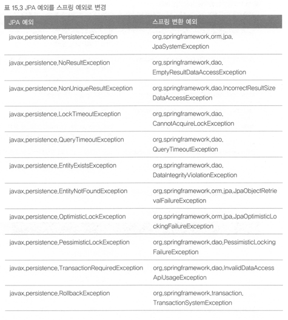

데이터 접근 계층의 예외는 아니지만 JPA 표준명세상 발생할 수 있는 예외도 추상화한다. 
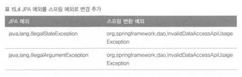

## 15.1.3 스프링 프레임워크에 JPA 예외 변환기 적용
```kotlin
@Bean
fun exceptionTranslation(): PersistenceExceptionTranslationPostProcessor {
    return PersistenceExceptionTranslationPostProcessor()
}
```
- JPA 예외를 스프링의 추상화된 예외로 변경하려면 `PersistenceExceptionTranslationPostProcessor`를 스프링 빈으로 등록하면 된다.
  (스프링 부트에서는 이걸 따로 등록하진 않아도 된다.)

```kotlin
fun findMember(): Member? {
    return em.createQuery("select m from Member m where m.id=100", Member::class.java).singleResult
}
// org.springframework.dao.EmptyResultDataAccessException: No entity found for query; nested exception is javax.persistence.NoResultException: No entity found for query
```
findMember는 NoResultException이 발생하고 스프링이 EmptyResultDataAccessException로 변환한다.

```kotlin
interface CustomMemberRepository {
    @kotlin.jvm.Throws(NoResultException::class)
    fun findMember(): Member?
}

class MemberRepositoryImpl: CustomMemberRepository {
    @Autowired
    lateinit var em: EntityManager

    override fun findMember(): Member? {
        return em.createQuery("select m from Member m where m.id=100", Member::class.java).singleResult
    }
}
// javax.persistence.NoResultException: No entity found for query
```
예외를 변환하고 싶지 않으면 throw를 명시하면 된다.

## 15.1.4 트랜잭션 롤백 시 주의사항
트랜잭션 롤백은 DB만 롤백하는 것이지 엔티티 객체를 그대로다. 따라서 트랜잭션이 롤백된 영속성 컨텍스트를 그대로 사용하는 것은 위험하다. 새로 만들거나 초기화를 한 후에 사용해야한다.
스프링 프레임워크는 이런 문제를 예방하기 위해 영속성 컨텍스트 범위에 따라 다른 방법을 사용한다. 영속성 컨텍스트를 트랜잭션 범위보다 넓게 사용하는 경우 초기화를 해서 잘못 하는 문제를 예방한다.
```java
@Override
protected void doRollback(DefaultTransactionStatus status) {
  JpaTransactionObject txObject = (JpaTransactionObject) status.getTransaction();
  if (status.isDebug()) {
    logger.debug("Rolling back JPA transaction on EntityManager [" +
        txObject.getEntityManagerHolder().getEntityManager() + "]");
  }
  try {
    EntityTransaction tx = txObject.getEntityManagerHolder().getEntityManager().getTransaction();
    if (tx.isActive()) {
      tx.rollback();
    }
  }
  catch (PersistenceException ex) {
    throw new TransactionSystemException("Could not roll back JPA transaction", ex);
  }
  finally {
    if (!txObject.isNewEntityManagerHolder()) {
      // Clear all pending inserts/updates/deletes in the EntityManager.
      // Necessary for pre-bound EntityManagers, to avoid inconsistent state.
      txObject.getEntityManagerHolder().getEntityManager().clear();
    }
  }
}
```

# 15.2 엔티티 비교
- 영속성 컨텍스트 내부의 1차 캐시는 영속성 컨텍스트와 생명주기를 같이한다.
- 더 정확히 이해하기 위해서는 **애플리케이션 수준의 반복가능한 읽기**를 이해해야 한다.

## 15.2.1 영속성 컨텍스트가 같을 때 엔티티 비교
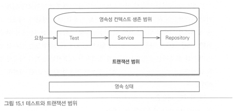

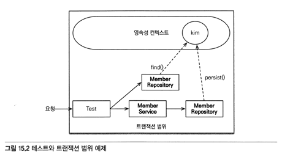
- 동일성(==): true
- 동등성(equals): true
- DB 동등성: DB 식별자가 같다.

## 15.2.2 영속성 컨텍스트가 다를때 엔티티 비교
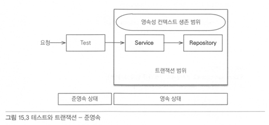

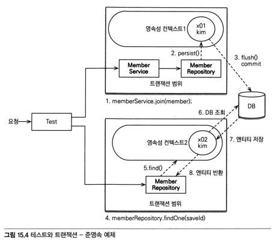
- 동일성(==): false
- 동등성(equals): true (단, equals를 구현해야한다.)
- DB 동등성: DB 식별자가 같다.

# 15.3 프록시 심화 주제

## 15.3.1 영속성 컨텍스트와 프록시
- 프록시 조회 후 엔티티를 조회한 경우
  - 프록시와 엔티티 모두 프록시 객체로 조회된다.
- 엔티티 조회 후 프록시를 조회한 경우
  - 프록시와 엔티티 모두 엔티티 객체로 조회된다.

## 15.3.2 프록시 타입 비교
- 프록시는 원본 엔티티를 상속받아서 만들어지므로 엔티티 타입을 비교할때는 == 대신 instanceof를 사용해야한다.

## 15.3.3 프록시 동등성 비교
- 엔티티의 동등성을 비교하려면 비지니스 키를 사용해서 equals를 오버라이드 하면 된다.
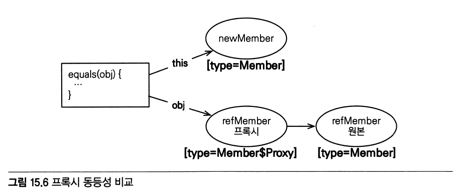

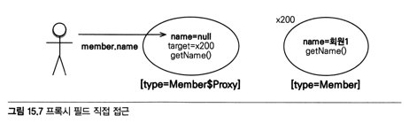


```java
@Override
public boolean equals(Object obj) {
  if (this == obj) return true;
  if (!(obj instanceof Member)) return false;
  Member member = (Member) obj;
  if (name != null? !name.equals(member.getName()) : member.getName() != null) return false;
  return true;
}
```
- 타입비교는 == 대신 instanceof
- 멤버변수에 직접 접근 대신 getter 메소드 사용

```kotlin
override fun equals(obj: Any?): Boolean {
    if (this === obj) return true
    if (obj !is Member) return false
    return name != obj.name
}
```
- 코틀린에서는 좀 더 코드가 단축될 수 있다.

## 15.3.4 상속관계와 프록시
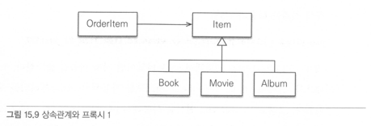

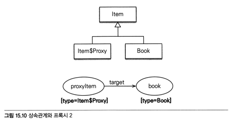
- 상속관계에서 프록시를 조회하면 부모타입으로 조회된다. `proxyItem instanof Book` 과 같은 비교는 실패한다.

### JPQL로 대상 직접 조회
- 자식 타입을 직접 조회하면 해결되나 다형성을 활용할 수 없다. 

### 프록시 벗기기
- 하이버네이트에서 제공하는 unProxy를 사용
- 프록시에서 원본 엔티티를 직접 꺼내기 때문에 프록시와 원본 엔티티의 동일성 비교가 실패한다. => 꼭 필요한 곳에서 잠깐 사용하고 다른 곳에서는 사용하지 않아야 한다.

### 기능을 위한 별도의 인터페이스 제공
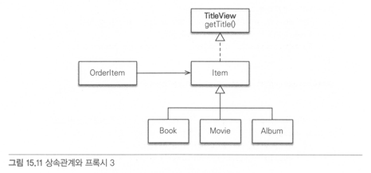
- 자식클래스들이 getTitle()를 각각 구현했으니 getTitle()을 사용해 비교할 수 있다.
- 다양한 타입이 추가되어도 Item을 사용하는 코드를 수정하지 않아도 된다.

### 비지터 패턴 사용
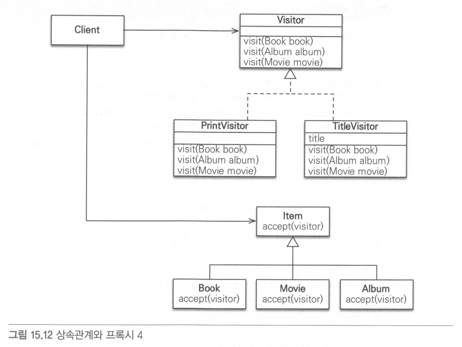
```kotlin
interface ItemVisitor {
  fun visit(book: Book)
  fun visit(album: Album)
  fun visit(movie: Movie)
}

class TitleVisitor: ItemVisitor {
  var title: String = ""

  override fun visit(book: Book) {
    // 넘어오는 값은 프록시가 아닌 엔티티
    title = "[제목:${book.name} 저자:${book.author}]"
  }
}
```
- 제목을 보관하는 TitleVisitor를 작성

```kotlin
@Entity
@Inheritance(strategy = InheritanceType.SINGLE_TABLE)
@DiscriminatorColumn(name = "DTYPE")
abstract class Item(
    @Id
    @GeneratedValue
    @Column(name = "ITEM_ID")
    open var id: Long? = null,
) {
    abstract fun accept(visitor: ItemVisitor)
}

@Entity
@DiscriminatorValue("A")
class Album(
    var artist: String = "",
    var etc: String = ""
): Item() {
    override fun accept(visitor: ItemVisitor) {
        visitor.visit(this)
    }
}
```
- 자식클래스는 accept를 구현하는데 visitor에 자신을 넘기는 것이 전부. 로직처리는 visitor에 위임한다.

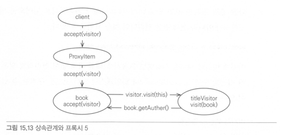
- 비지터 패턴을 사용하면 프록시에 대한 걱정없이 안전하게 원본 엔티티에 접근할 수 있고 타입캐스팅없이 코드를 구현할 수 있다.
- 새로운 기능이 필요할때 Visitor만 추가하면 되므로 기존 코드 변경없이 기능을 추가할 수 있다.
- 너무 복잡하고 더블 디스패치(accept, visit)를 사용하기 때문에 이해하기 어렵다.
- 객체구조가 변경되면 모든 Visitor를 수정해야한다.

# 15.4 성능 최적화

## 15.4.1 N+1 문제

## 15.4.2 읽기 전용 쿼리의 성능 최적화

## 15.4.3 배치 처리

## 15.4.4 SQL 쿼리 힌트 사용

## 15.4.5 트랜잭션을 지원하는 쓰기 지연과 성능 최적화

