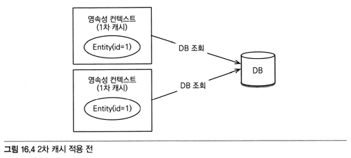
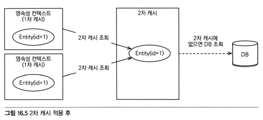
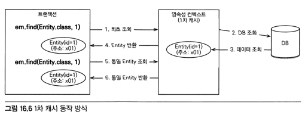
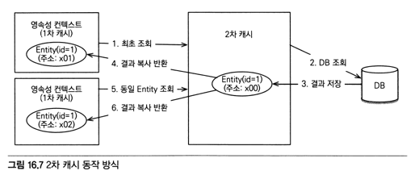

# 16.1 트랜잭션과 락
## 16.1.1 트랜잭션과 격리 수준
- 트랜잭션은 ACID를 보장해야한다.
  - 원자성 (Atomicity): 트랜잭션안에서는 모두 실패하거나 모두 성공해야한다.
  - 일관성 (Consistency): DB에서 정한 무결성 제약조건을 항상 만족해야한다.
  - 격리성 (Isolation): 동시에 실행되는 트랜잭션들이 서로 영향을 미치지 않도록 격리해야한다.
  - 지속성 (Durability): 트랜잭션을 성공하면 결과가 항상 기록되어야 한다. 시스템 문제가 발생해도 db로그등으로 트랜잭션을 복구해야한다.
- 격리성을 보장하려면 트랜잭션을 차례대로 실행해야하는데 이렇게 하면 동시성 처리 성능이 매우 나빠진다.
- ANSI 표준은 트랜잭션의 격리수준을 4단계로 나누어 정의했다.

| 격리수준 | DIRTY READ | NON-REPEATABLE READ | PHANTOM READ |
| --- | --- | --- | --- |
| READ UNCOMMITTED | O | O | O |
| READ COMMITTED |  | O | O |
| REPEATABLE READ |  |  | O |
| SERIALIZABLE |  |  |  |

- READ UNCOMMITTED: 커밋되지 않은 데이터를 읽을 수 있다.(DIRTY READ)
- READ COMMITTED: 커밋한 데이터만 읽을 수 있다. 한번 조회한 데이터를 다른 트랜잭션이 수정하면 이후에 수정한 값으로 조회된다. (NON-REPEATABLE READ)
- REPEATABLE READ: 한번 조회한 데이터를 다시 조회해도 같은 값이 조회된다. 하지만 값이 추가된 경우 추가된 값은 조회된다. (PHANTOM READ)
- SERIALIZABLE: 추가된 값도 조회되지 않는다. 동시성 처리 성능이 급격히 떨어질 수 있다.

## 16.1.2 낙관적 락과 비관적 락 기초
JPA의 1차캐시를 적절히 활용하면 READ COMMITTED 수준이어도 REPEATABLE READ가 가능하다.

- 낙관적 락: 트랜잭션 충돌이 발생하지 않는다고 가정하는 방법
  - DB 락 대신 어플리케이션 락 사용
- 비관적 락: 트랜잭션 충돌이 발생한다고 가정하고 우선 락을 거는 방법
  - DB 락 사용

두번의 갱신 분실 문제(A와 B 수정을 동시에 시작하고 A를 완료한 후에 B를 완료하여 A의 수정사항이 사라지고 B의 수정사항만 반영되는 것)은 트랜잭션만으로 해결할 수 없다.
- 마지막 커밋만 인정하기: B내용만 인정 (기본)
- 최초 커밋만 인정하기: B완료시 오류 (JPA 버전관리기능으로 구현가능)
- 충돌하는 갱신내용 병합하기 (개발자가 직접 구현)

## 16.1.3 @Version
낙관적 락을 사용하려면 `@Version` 어노테이션을 사용해서 버전 관리기능을 추가해야한다.
- Long, Integer, Short, Timestamp에 적용가능

```java
@Entity
class Board {
    @Id
    private String id;
    @Version
    private Integer version;
}
```
- 버전 관리용 필드를 추가하면 엔티티를 수정할때마다 버전이 하나씩 증가한다.
- 엔티티를 수정할때 조회시점의 버전과 다르면 예외가 발생한다.

```java
// 트랜잭션1 조회: title="제목A", version=1
Board board = em.find(Board.class, id);

// 트랜잭션2 수정: title="제목C", version=2

board.setTitle("제목B");
save(board);
tx.commit(); // 예외발생. db: version=2, 엔티티: version=1
```

- **버전정보를 사용하면 최초 커밋만 인정**하기가 적용된다.

```
update board
set title=?, version=? (버전 1증가)
where id=? and version=? (버전비교)
```
- 버전이 같으면 버전증가
- 버전이 다르면 수정대상이 없으므로 예외발생
- 벌크연산은 버전을 무시하므로 버전을 강제로 증가시켜야 한다.

## 16.1.4 JPA 락 사용
- 추천하는 전략은 READ COMMITTED + 낙관적 버전 관리

```java
Board board = em.find(Board.class, id, LockModeType.OPTIMISTIC);
em.lock(board, LockModeType.OPTIMISTIC);
```
- 락은 다음 위치에 적용할 수 있다.
  - EntityManager.lock(), find(), refresh()
  - Query.setLockMode()
  - @NamedQuery

```java
public enum LockModeType
{
    READ, // OPTIMISTIC 와 같다. JPA 1.0 호환 
    WRITE, // OPTIMISTIC_FORCE_INCREMENT 와 같다. JPA 1.0 호환 
    OPTIMISTIC, // 낙관적 락
    OPTIMISTIC_FORCE_INCREMENT, // 낙관적 락 + 버전정보 강제 증가
    PESSIMISTIC_READ, // 비관적 락, 읽기 락
    PESSIMISTIC_WRITE, // 비관적 락, 쓰기 락
    PESSIMISTIC_FORCE_INCREMENT, // 비관적 락 + 버전정보 강제 증가
    NONE // 락 없음
}
```

## 16.1.5 JPA 낙관적 락
- Version을 사용
- 트랜잭션 커밋 시점에 충돌을 알 수 있다.
  - JPA: javax.persistence.OptimisticLockException
  - 하이버네이트: org.hibernateStaleObjectStateException
  - 스프링: org.springframework.orm.ObjectOptimisticLockingFailureException

### NONE
- Version만 있으면 낙관적 락이 적용된다.
- 조회한 엔티티를 수정할때 다른 트랜잭션에 의해 수정되지 않아야 한다.
- 수정시 DB 버전과 다르면 예외 발생

### OPTIMISTIC
- 엔티티를 조회만 해도 버전을 체크한다.
- 조회 시점부터 트랜잭션이 끝날때까지 조회한 엔티티가 변경되지 않음을 보장
- 트랜잭션 커밋할때 버전정보를 조회해 버전을 검증한다. (수정하지 않아도)
- DIRTY READ, NON-REPEATABLE READ 방지


### OPTIMISTIC_FORCE_INCREMENT
- 연관관계의 엔티티가 수정되면 연관관계의 주인은 수정되지 않았지만 논리적으로는 수정될 수 있다.
- 이 옵션을 사용하면 연관관계의 주인이 버전도 증가시킨다.
- 엔티티 수정이 없어도 트랜잭션 커밋시 버전 UPDATE가 발생하고 검증이 실패하면 예외가 발생한다.
- 추가로 수정하면 수정시 버전 업데이트가 발생해 총 2번의 업데이트가 발생한다.


## 16.1.5 JPA 비관적 락
- DB 트랜잭션 락 메터니즘에 의존하는 방법
- 주로 PESSIMISTIC_WRITE 모드를 사용
- 스칼라 타입 조회에서 사용가능
- 데이터 수정 즉시 트랜잭션 충돌 감지 가능
  - JPA: javax.persistence.OptimisticLockException
  - 스프링: org.springframework.orm.ObjectOptimisticLockingFailureException

### PESSIMISTIC_WRITE
- DB 쓰기 락
- NON-REPEATABLE READ 방지

### PESSIMISTIC_READ
- 반복 읽기만 하고 수정하지 않는 용도로 락을 걸때 사용
- DB 대부분 PESSIMISTIC_WRITE로 동작
  - MySQL: lock in share mode
  - PostgreSQL: for share

### PESSIMISTIC_FORCE_INCREMENT
- 버전정보를 사용한다.
- 하이버네이트는 nowait를 지원한느 DB에 대해서 for update nowait옵션을 적용한다.
  - 오라클: for update nowait
  - PostgreSQL: for update nowait
  - nowait 지원 X: for update

## 16.1.5 비관적 락과 타임아웃
비관적 락을 사용하면 락을 획득할때까지 트랜잭션이 대기한다.
타임아웃을 사용할 수 있는데 DB 특성에 따라 동작하지 않을 수 있다.

```java
Map<String, Object> properties = new HashMap<>();
properties.put("javax.persistence.lock.timeout", 10000); // 타임아웃 10초 설정
em.find(Board.class, "boardId", LockModeType.PESSIMISTIC_WRITE, properties);
```

# 16.2 2차 캐시
## 16.2.1 1차 캐시와 2차 캐시
- 1차 캐시
  - 영속성 컨텍스트 내부 엔티티 보관 저장소
  - 웹 어플리케이션 환경에서 트랜잭션 시작-종료까지만 유효하여 DB 접근을 획기적으로 줄이지는 못한다.
- 2차 캐시
  - 대부분의 JPA 구현체가 지원하는 어플리케이션 범위의 캐시





### 1차 캐시
- 옵션이 아니다. 영속성 컨텍스트가 1차 캐시


1. 최초조회: 1차 캐시에 엔티티가 없다.
2. DB에서 엔티티를 조회한다.
3. 1차 캐시에 보관한다.
4. 1차 캐시에 보관한 결과를 반환
5. 이후 엔티티 조회시 1차캐시에서 엔티티를 찾을 수 있다.
6. 1차캐시에서 찾은 엔티티를 반환한다.

- 객체를 그대로 반환하므로 동일성 보장

### 2차 캐시
- JPA는 공유캐시(shared cache)라 하는데 일반적으로 2차캐시라고 부른다.
- 애플리케이션 범위의 캐시. 앱 종료까지 유지된다. 분산캐시 등은 더 오래 유지될 수도 있다.


1. 영속성 컨텍스트는 엔티티가 필요하면 2차 캐시를 조회
2. 없으면 DB를 조회
3. DB 조회 결과를 2차 캐시에 보관
4. 보관한 엔티티를 복사해서 반환
5. 이후 엔티티 조회시 2차캐시에서 엔티티를 찾을 수 있다.
6. 2차캐시에서 찾은 엔티티의 복사본을 반환

- 동시성을 극대화하려고 객체의 복사본을 만들어 반환
- 영속성 유닛 범위의 캐시
- 영속성 컨텍스트가 다르면 동일성을 보장하지 않는다.

## 16.2.2 JPA 2차 캐시 기능
- 각 구현체가 캐시를 각자 지원하다가 JPA 2.0에서 표준을 정의
- JPA 캐시 표준은 구현체가 공통으로 사용하는 기능만 표준화해서 세부 설정은 구현체 의존적 기능을 사용해야한다

### 캐시 모드 설정
- Entity에 `@Cacheable(true | false)`을 설정할 수 있다. 기본값은 true
- persistence.xml에 share-cache-mode 설정
- 스프링에서는 LocalContainerEntityManagerFactoryBean.sharedCacheMode 설정

```java
public enum SharedCacheMode {
    ALL, // 모든 엔티티를 캐시  
    NONE, // 캐시 사용 X
    ENABLE_SELECTIVE, // Cacheable(true)로 설정된 엔티티만 캐시 적용
    DISABLE_SELECTIVE, // 모든 엔티티 캐시하나 Cacheable(false)로 명시한 엔티티만 제외
    UNSPECIFIED // JPA 구현체가 정의한 설정을 따름
}
```

### 캐시 조회, 저장 방식 설정
캐시를 무시하고 DB조회/갱신을 하려면 캐시조회모드, 캐시보관모드를 사용
```java
em.setEntity("javax.persistence.cache.retrieveMode", CacheRetrieveMode.BYPASS);
```
- javax.persistence.cache.retrieveMode: 조회모드 프로퍼티이름
- javax.persistence.cache.storeMode: 보관모드 프로퍼티 이름

```java
// 조회모드 설정 옵션
public enum CacheRetrieveMode {
    USE, // 캐시에서 조회 (기본값)
    BYPASS // 캐시를 무시하고 DB 직접 접근
}
```

```java
// 보관모드 설정 옵션
public enum CacheStoreMode {
    USE, // 캐시에 저장 (기본값)
    BYPASS, // 캐시에 저장 X
    REFRESH // USE + 조회한 엔티티를 최신상태로 다시 캐시
}
```

- Query.setHint() 에도 사용할 수 있다.

### JPA 캐시 관리 API
```java
public interface Cache {
    // 캐시 여부 확인
    public boolean contains(Class cls, Object primaryKey);
    // 특정 식별자를 가진 캐시 제거
    public void evict(Class cls, Object primaryKey);
    // 엔티티 전체 캐시 제거
    public void evict(Class cls);
    // 모든 케시 제거
    public void evictAll();
    // JPA Cache 구현체 조회
    public <T> T unwrap(Class<T> cls);
}
```
- EntityManager.getCache()로 구할 수 있다.

## 16.2.3 하이버네이트와 EHCACHE 적용
하이버네이트가 지원하는 캐시
- 엔티티 캐시: 엔티티 단위 캐시
- 컬렉션 캐시: 엔티티와 연관된 컬렉션을 캐시. 컬렉션의 엔티티는 식별자만 캐시 (하이버네이트 기능)
- 쿼리 캐시: 쿼리와 파라미터 정보를 키로 사용해서 캐시. 결과가 엔티티면 식별자 값만 캐시 (하이버네이트 기능)

### 환경설정
- hibernate-ecache 라이브러리 사용
- net.sf.ecache-core도 추가됨 (ehcache.xml 설정파일 사용)
  - 책에서 소개하는 내용은 ehcache 2.x
  - 3.x는 https://www.ehcache.org/documentation/3.9/getting-started.html
- 하이버네이트에 캐시 사용정보 설정 (persistence.xml)
  - hibernate.cache.use_second_level_cache: 2차 캐시 활성화
  - hibernate.cache.use_query_cache: 쿼리 캐시 활성화
  - hibernate.cache.region.factory_class: 캐시를 처리할 클래스 지정 (ehcache는 org.hibernate.cache.ehcache.EhCacheRegionFactory)
  - hibernate.cache.generate_statistics: 하이버네이트의 여러 통계 정보 출력

```
<properties>
    ...
    <property name="hibernate.cache.use_second_level_cache" value="true"/>
    <property name="hibernate.cache.region.factory_class" 
      value="org.hibernate.cache.ehcache.EhCacheRegionFactory"/>
    ...
</properties>
```

### 엔티티 캐시와 컬렉션 캐시
```java
import javax.persistence.Cacheable;
import org.hibernate.annotations.Cache;

@Entity
@Cacheable
@Cache(usage = CacheConcurrencyStrategy.READ_WRITE)
public class Foo {

    //...

    @Cacheable
    @Cache(usage = CacheConcurrencyStrategy.READ_WRITE)
    @OneToMany
    private Collection<Bar> bars;

    // getters and setters
}
```
- @Cache
  - usage: CacheConcurrencyStrategy를 사용해 동시성 전략을 설정
  - region: 캐시 지역 설정
  - include: 연관객체의 캐시 포함여부 (all:기본값, non-lazy)

```java
public enum CacheConcurrencyStrategy {
    NONE(null), // 캐시 X
    READ_ONLY(AccessType.READ_ONLY), // 읽기 전용으로 설정. 수정이 불가능. 수정이 불가능하여 2차캐시가 복사본이 아닌 원본을 반환
    NONSTRICT_READ_WRITE(AccessType.NONSTRICT_READ_WRITE), // 엄격하지 않은 전략. 동시에 엔티티를 수정하면 일관성이 깨질 수 있다.
    READ_WRITE(AccessType.READ_WRITE), // READ COMMITTED 정도의 격리 수준 보장. EHCACHE는 데이터를 수정하면 캐시도 같이 수정
    TRANSACTIONAL(AccessType.TRANSACTIONAL); // 컨테이너 관리 환경에서 사용할 수 있다. REPEATABLE READ 정도의 격리 수준 보장
}
```
- 책에서 소개하는 버전: https://docs.jboss.org/hibernate/orm/4.3/manual/en-US/html_single/#performance-cache-compat-matrix
- 최신버전: https://docs.jboss.org/hibernate/orm/6.0/userguide/html_single/Hibernate_User_Guide.html#caching

### 캐시 영역
- 엔티티 캐시 영역: 패키지명 + 클래스명
- 컬렉션 캐시 영역: 패키지명 + 클래스명 + 컬렉션 필드명
- region옵션으로 직접 지정가능
- hibernate.cache.region_prefix로 접두설 설정가능
- 세부설정은 문서(https://www.ehcache.org/documentation/3.9/getting-started.html) 참고

### 쿼리 캐시
- 쿼리와 파라미터 정보를 키로 사용해 결과를 캐시하는 방법
- hibernate.cache.use_query_cache를 true로 설정하면 사용할 수 있다.
- 적용하려는 쿼리마다 org.hibernate.cacheable를 true로 설정

### 쿼리 캐시 영역
쿼리캐시를 활성화하면 두 캐시 영역이 추가된다.
- org.hibernate.cache.internal.StandardQueryCache: 쿼리 캐시 저장 영역(실행시점 타임스탬프 포함)
- org.hibernate.cache.spi.UpdateTimestampsCache: 캐시 유효성 확인을 위한 가장 최근 변경 시간 저장

- 쿼리 실행시간과 캐시가 사용하는 테이블이 가장 최근에 변경된 시간을 비교한다.
- 빈번한 변경이 있는 테이블에 사용하면 오히려 성능이 저하되므로 잘 변경되지 않는 테이블에 사용

### 쿼리 캐시와 컬렉션 캐시의 주의점
- 쿼리캐시, 컬렉션캐시는 식별자 값만 캐시한다.
- 엔티티 캐시를 적용하지 않으면 결국 SQL을 실행하게 되므로 결과 수만큼 SQL이 실행될 수 있다.
