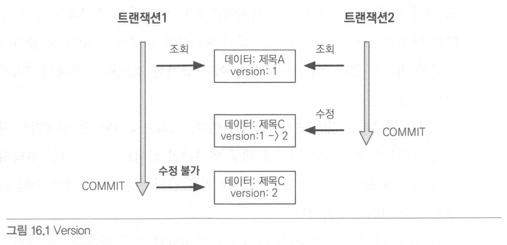
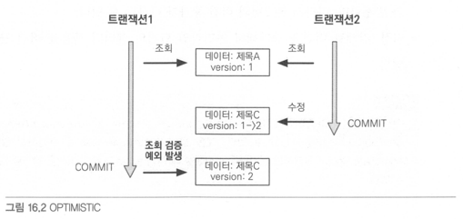
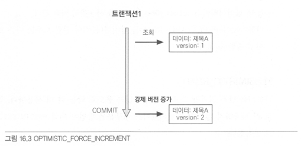

# 16.1 트랜잭션과 락
## 16.1.1 트랜잭션과 격리 수준
- 트랜잭션은 ACID를 보장해야한다.
  - 원자성 (Atomicity): 트랜잭션안에서는 모두 실패하거나 모두 성공해야한다.
  - 일관성 (Consistency): DB에서 정한 무결성 제약조건을 항상 만족해야한다.
  - 격리성 (Isolation): 동시에 실행되는 트랜잭션들이 서로 영향을 미치지 않도록 격리해야한다.
  - 지속성 (Durability): 트랜잭션을 성공하면 결과가 항상 기록되어야 한다. 시스템 문제가 발생해도 db로그등으로 트랜잭션을 복구해야한다.
- 격리성을 보장하려면 트랜잭션을 차례대로 실행해야하는데 이렇게 하면 동시성 처리 성능이 매우 나빠진다.
- ANSI 표준은 트랜잭션의 격리수준을 4단계로 나누어 정의했다.

| 격리수준 | DIRTY READ | NON-REPEATABLE READ | PHANTOM READ |
| --- | --- | --- | --- |
| READ UNCOMMITTED | O | O | O |
| READ COMMITTED |  | O | O |
| REPEATABLE READ |  |  | O |
| SERIALIZABLE |  |  |  |

- READ UNCOMMITTED: 커밋되지 않은 데이터를 읽을 수 있다.(DIRTY READ)
- READ COMMITTED: 커밋한 데이터만 읽을 수 있다. 한번 조회한 데이터를 다른 트랜잭션이 수정하면 이후에 수정한 값으로 조회된다. (NON-REPEATABLE READ)
- REPEATABLE READ: 한번 조회한 데이터를 다시 조회해도 같은 값이 조회된다. 하지만 값이 추가된 경우 추가된 값은 조회된다. (PHANTOM READ)
- SERIALIZABLE: 추가된 값도 조회되지 않는다. 동시성 처리 성능이 급격히 떨어질 수 있다.

## 16.1.2 낙관적 락과 비관적 락 기초
JPA의 1차캐시를 적절히 활용하면 READ COMMITTED 수준이어도 REPEATABLE READ가 가능하다.

- 낙관적 락: 트랜잭션 충돌이 발생하지 않는다고 가정하는 방법
  - DB 락 대신 어플리케이션 락 사용
- 비관적 락: 트랜잭션 충돌이 발생한다고 가정하고 우선 락을 거는 방법
  - DB 락 사용

두번의 갱신 분실 문제(A와 B 수정을 동시에 시작하고 A를 완료한 후에 B를 완료하여 A의 수정사항이 사라지고 B의 수정사항만 반영되는 것)은 트랜잭션만으로 해결할 수 없다.
- 마지막 커밋만 인정하기: B내용만 인정 (기본)
- 최초 커밋만 인정하기: B완료시 오류 (JPA 버전관리기능으로 구현가능)
- 충돌하는 갱신내용 병합하기 (개발자가 직접 구현)

## 16.1.3 @Version
낙관적 락을 사용하려면 `@Version` 어노테이션을 사용해서 버전 관리기능을 추가해야한다.
- Long, Integer, Short, Timestamp에 적용가능

```java
@Entity
class Board {
    @Id
    private String id;
    @Version
    private Integer version;
}
```
- 버전 관리용 필드를 추가하면 엔티티를 수정할때마다 버전이 하나씩 증가한다.
- 엔티티를 수정할때 조회시점의 버전과 다르면 예외가 발생한다.

```java
// 트랜잭션1 조회: title="제목A", version=1
Board board = em.find(Board.class, id);

// 트랜잭션2 수정: title="제목C", version=2

board.setTitle("제목B");
save(board);
tx.commit(); // 예외발생. db: version=2, 엔티티: version=1
```

- **버전정보를 사용하면 최초 커밋만 인정**하기가 적용된다.

```
update board
set title=?, version=? (버전 1증가)
where id=? and version=? (버전비교)
```
- 버전이 같으면 버전증가
- 버전이 다르면 수정대상이 없으므로 예외발생
- 벌크연산은 버전을 무시하므로 버전을 강제로 증가시켜야 한다.

## 16.1.4 JPA 락 사용
- 추천하는 전략은 READ COMMITTED + 낙관적 버전 관리

```java
Board board = em.find(Board.class, id, LockModeType.OPTIMISTIC);
em.lock(board, LockModeType.OPTIMISTIC);
```
- 락은 다음 위치에 적용할 수 있다.
  - EntityManager.lock(), find(), refresh()
  - Query.setLockMode()
  - @NamedQuery

```java
public enum LockModeType
{
    READ, // OPTIMISTIC 와 같다. JPA 1.0 호환 
    WRITE, // OPTIMISTIC_FORCE_INCREMENT 와 같다. JPA 1.0 호환 
    OPTIMISTIC, // 낙관적 락
    OPTIMISTIC_FORCE_INCREMENT, // 낙관적 락 + 버전정보 강제 증가
    PESSIMISTIC_READ, // 비관적 락, 읽기 락
    PESSIMISTIC_WRITE, // 비관적 락, 쓰기 락
    PESSIMISTIC_FORCE_INCREMENT, // 비관적 락 + 버전정보 강제 증가
    NONE // 락 없음
}
```

## 16.1.5 JPA 낙관적 락
- Version을 사용
- 트랜잭션 커밋 시점에 충돌을 알 수 있다.
  - JPA: javax.persistence.OptimisticLockException
  - 하이버네이트: org.hibernateStaleObjectStateException
  - 스프링: org.springframework.orm.ObjectOptimisticLockingFailureException

### NONE
- Version만 있으면 낙관적 락이 적용된다.
- 조회한 엔티티를 수정할때 다른 트랜잭션에 의해 수정되지 않아야 한다.
- 수정시 DB 버전과 다르면 예외 발생

### OPTIMISTIC
- 엔티티를 조회만 해도 버전을 체크한다.
- 조회 시점부터 트랜잭션이 끝날때까지 조회한 엔티티가 변경되지 않음을 보장
- 트랜잭션 커밋할때 버전정보를 조회해 버전을 검증한다. (수정하지 않아도)
- DIRTY READ, NON-REPEATABLE READ 방지



### OPTIMISTIC_FORCE_INCREMENT
- 연관관계의 엔티티가 수정되면 연관관계의 주인은 수정되지 않았지만 논리적으로는 수정될 수 있다.
- 이 옵션을 사용하면 연관관계의 주인이 버전도 증가시킨다.
- 엔티티 수정이 없어도 트랜잭션 커밋시 버전 UPDATE가 발생하고 검증이 실패하면 예외가 발생한다.
- 추가로 수정하면 수정시 버전 업데이트가 발생해 총 2번의 업데이트가 발생한다.



## 16.1.5 JPA 비관적 락
- DB 트랜잭션 락 메터니즘에 의존하는 방법
- 주로 PESSIMISTIC_WRITE 모드를 사용
- 스칼라 타입 조회에서 사용가능
- 데이터 수정 즉시 트랜잭션 충돌 감지 가능
  - JPA: javax.persistence.OptimisticLockException
  - 스프링: org.springframework.orm.ObjectOptimisticLockingFailureException

### PESSIMISTIC_WRITE
- DB 쓰기 락
- NON-REPEATABLE READ 방지

### PESSIMISTIC_READ
- 반복 읽기만 하고 수정하지 않는 용도로 락을 걸때 사용
- DB 대부분 PESSIMISTIC_WRITE로 동작
  - MySQL: lock in share mode
  - PostgreSQL: for share

### PESSIMISTIC_FORCE_INCREMENT
- 버전정보를 사용한다.
- 하이버네이트는 nowait를 지원한느 DB에 대해서 for update nowait옵션을 적용한다.
  - 오라클: for update nowait
  - PostgreSQL: for update nowait
  - nowait 지원 X: for update

## 16.1.5 비관적 락과 타임아웃
비관적 락을 사용하면 락을 획득할때까지 트랜잭션이 대기한다.
타임아웃을 사용할 수 있는데 DB 특성에 따라 동작하지 않을 수 있다.

```java
Map<String, Object> properties = new HashMap<>();
properties.put("javax.persistence.lock.timeout", 10000); // 타임아웃 10초 설정
em.find(Board.class, "boardId", LockModeType.PESSIMISTIC_WRITE, properties);
```

# 16.2 2차 캐시
## 16.2.1 1차 캐시와 2차 캐시
## 16.2.2 JPA 2차 캐시 기능
## 16.2.3 하이버네이트와 EHCACHE 적용
